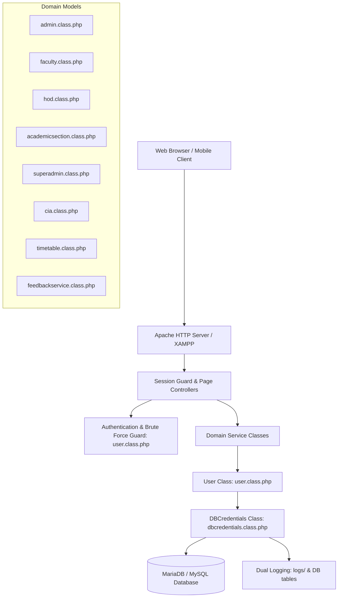

# JNTUACEA Class Attendance & CIA Marks Management System

Welcome to the technical and developer documentation for the JNTUACEA Class Attendance and Continuous Internal Assessment (CIA) Marks Management System.

This documentation suite provides a complete, accurate, and practical guide to the system's architecture, database schema, role-based workflows, and deployment procedures.

---

## 📚 Documentation Navigation

### 1. [Architecture](./architecture/)
- **[System Architecture Overview](./architecture/overview.md)**: High-level overview, runtime environment (PHP/Apache/XAMPP), session security, BCrypt migration, and dual logging subsystem.
- **[Class Hierarchy & Object Model](./architecture/class-hierarchy.md)**: Complete object hierarchy rooted at `DBCredentials` and `User`, domain model service classes, and composition patterns.
- **[Coding Standards & Conventions](./architecture/coding-standards.md)**: PHPDoc conventions, standardized method return arrays, database transaction patterns, and MySQLi prepared statements.

### 2. [Database Documentation](./database/)
- **[Database Schema Reference](./database/schema.md)**: Complete reference of all 48 tables from `u182589698_jntuaceasarb_database_scheme.sql`, organized by functional domain.
- **[Entity-Relationship Diagrams & Keys](./database/relationships.md)**: Mermaid ER diagrams, explicit foreign keys, and exact table join mechanisms (`users.username` joins, mapping tables).
- **[Data Dictionary](./database/data-dictionary.md)**: Status flags, enumeration values (`assessment_components`), criteria operators, and Bloom's taxonomy definitions.

### 3. [Workflows & Business Logic](./workflows/)
- **[Attendance Marking & Diary Workflow](./workflows/attendance-marking.md)**: Subject selection, hour validation, student mapping verification, and atomic database transactions.
- **[Attendance Deletion & Approval Lifecycle](./workflows/attendance-deletion.md)**: Faculty deletion requests, reason tracking, and HOD review/approval lifecycle.
- **[CIA Marks Entry & Calculations](./workflows/cia-marks-entry.md)**: Theory, Lab, PG, and Project marks entry, aggregation algorithms, and CSV/Excel exports.
- **[Timetable Management](./workflows/timetable-management.md)**: Class timing slots, class schedule ranges, HOD allocation, and faculty weekly timetables.
- **[CO-PO Attainment & OBE Analysis](./workflows/co-po-attainment.md)**: Course Outcomes, Bloom's levels, question-to-CO mapping, and NBA attainment matrices.
- **[Student Feedback & Institutional Surveys](./workflows/feedback-surveys.md)**: Course Outcomes indirect feedback, 5-domain Course End Surveys (CES), faculty appraisals, strict anonymity safeguards, and PDF/Excel exports.

### 4. [Roles & Permissions](./roles-and-permissions/)
- **[Role Permission Matrix](./roles-and-permissions/matrix.md)**: Cross-cutting feature and page access matrix across all five active administrative roles (`superadmin`, `admin`, `academic_section`, `hod`, `faculty`).
- **[Role Guides](./roles-and-permissions/role-guides.md)**: Comprehensive guide detailing responsibilities, script entrypoints, and underlying class methods for each role.

### 5. [Deployment & Operations](./deployment/)
- **[Installation & Configuration](./deployment/configuration.md)**: System prerequisites, `.env.php` setup in the parent directory, file permissions, and database initialization.
- **[Maintenance & Operations](./deployment/maintenance.md)**: Database backups, session cleanup, log rotation, and transparent password migration from MD5 to BCrypt.

---

## 🏛️ System Overview

The system is built as a modular monolithic PHP application serving the administrative and academic needs of JNTUA College of Engineering Ananthapuramu (Autonomous).

### Core Characteristics:
- **Presentation Layer**: Procedural PHP page controllers that check `$_SESSION['role']` and render Bootstrap 4/5 user interfaces.
- **Service/Domain Layer**: Object-oriented PHP model classes (`*.class.php`) handling business logic, database queries, and input sanitization.
- **Data Access Layer**: `DBCredentials` singleton providing `mysqli` prepared statements with transactional safety.
- **Authentication**: Session-based with brute-force lockouts and on-the-fly upgrading of legacy MD5 hashes to BCrypt hashes.
