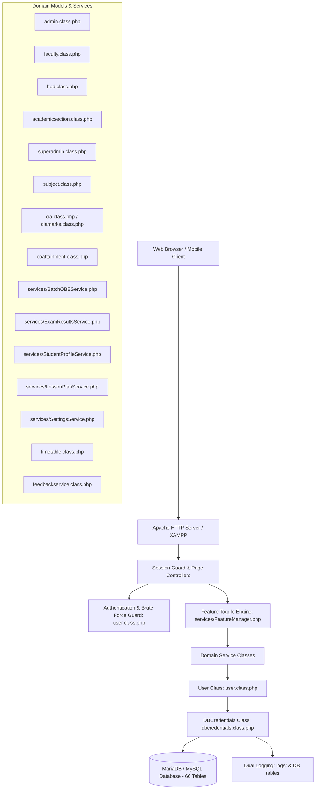

# JNTUACEA Class Attendance & CIA Marks Management System

Welcome to the technical and developer documentation for the JNTUACEA Class Attendance and Continuous Internal Assessment (CIA) Marks Management System.

This documentation suite provides a complete, accurate, and practical guide to the system's architecture, database schema, role-based workflows, and deployment procedures.

---

## 📚 Documentation Navigation

### 1. [Architecture](./architecture/)
- **[System Architecture Overview](./architecture/overview.md)**: High-level overview, runtime environment (PHP/Apache/XAMPP), session security, BCrypt migration, and dual logging subsystem.
- **[Class Hierarchy & Object Model](./architecture/class-hierarchy.md)**: Complete object hierarchy rooted at `DBCredentials` and `User`, domain model service classes, and composition patterns.
- **[Coding Standards & Conventions](./architecture/coding-standards.md)**: PHPDoc conventions, standardized method return arrays, database transaction patterns, and MySQLi prepared statements.

### 2. [Database Documentation](./database/)
- **[Database Schema Reference](./database/schema.md)**: Complete reference of all 66 tables, organized by 10 functional domains.
- **[Entity-Relationship Diagrams & Keys](./database/relationships.md)**: Mermaid ER diagrams, explicit foreign keys, and exact table join mechanisms (`users.username` joins, mapping tables).
- **[Data Dictionary](./database/data-dictionary.md)**: Status flags, enumeration values (`assessment_components`), criteria operators, Bloom's taxonomy definitions, 15 feature toggle states, academic settings categories, grade scales, and custody statuses.

### 3. [Workflows & Business Logic](./workflows/)
- **[Batch-Centric Governance & Full-Cycle OBE Hierarchy](./workflows/batch-obe-governance.md)**: Permanent student cohorts, Vision & Mission, PEOs, dual articulation mapping (PEO-Mission & PO-PEO), and multi-tier macro-attainment backtracking.
- **[Results Publication & Automated SEE Marks Ingestion](./workflows/results-publication.md)**: Exam notifications, bulk CSV results upload, automatic grade points conversion, student grade cards, dynamic SGPA, and 1-click auto-syncing of external exam marks.
- **[Student Profile, Document Vault, Custody Ledger & Certificates](./workflows/student-profile-and-certificates.md)**: Student biographical dossier, digital document vault, physical original certificate tracking, and statutory certificate generation (Custodial, TC, Study & Conduct, Bonafide, No Dues).
- **[Attendance Marking & Diary Workflow](./workflows/attendance-marking.md)**: Subject selection via `Subject` class, hour validation, frictionless daily topic logging, and atomic database transactions.
- **[Lesson Planning, Reconciliation & Compliance Workflow](./workflows/lesson-plan-and-compliance.md)**: Lecture syllabus planning, bulk CSV upload, end-of-course daily topic reconciliation, and NBA Criterion 2.2 course completion compliance audits.
- **[Attendance Deletion & Approval Lifecycle](./workflows/attendance-deletion.md)**: Faculty deletion requests, reason tracking, and HOD review/approval lifecycle.
- **[CIA & SEE Marks Entry & Calculations](./workflows/cia-marks-entry.md)**: Theory, Lab, PG, Project, and Semester End Exam (SEE) marks entry, dynamic regulatory rules via `SettingsService`, and official e-Bluebook generation via `EBluebookPDFService`.
- **[Timetable Management](./workflows/timetable-management.md)**: Class timing slots, class schedule ranges, section handling, HOD allocation, and faculty weekly timetables.
- **[CO-PO Attainment & OBE Analysis](./workflows/co-po-attainment.md)**: Course Outcomes, Bloom's levels, question-to-CO mapping, direct/indirect NBA attainment matrices, and official dossier export via `OBEAnalysisPDFService`.
- **[Student Feedback & Institutional Surveys](./workflows/feedback-surveys.md)**: Course Outcomes indirect feedback, 5-domain Course End Surveys (CES), faculty appraisals, strict anonymity safeguards, and PDF/Excel exports.

### 4. [Roles & Permissions](./roles-and-permissions/)
- **[Master User, Feature, File & Database Table Mapping](./roles-and-permissions/user_feature_file_table_mapping.md)**: Exhaustive ground-truth mapping across all 6 roles, all 15 feature modules, 198 physical PHP controllers/views/services, and 66 read/write database tables.
- **[Role Permission Matrix](./roles-and-permissions/matrix.md)**: Cross-cutting feature and page access matrix across all six roles (`superadmin`, `admin`, `academic_section`, `hod`, `faculty`, `student`).
- **[Role Guides](./roles-and-permissions/role-guides.md)**: Comprehensive guide detailing responsibilities, script entrypoints, and underlying class methods for each role.

### 5. [Deployment & Operations](./deployment/)
- **[Installation & Configuration](./deployment/configuration.md)**: System prerequisites, `.env.php` setup in the parent directory, file permissions, and database initialization.
- **[Maintenance & Operations](./deployment/maintenance.md)**: Database backups, session cleanup, log rotation, and transparent password migration from MD5 to BCrypt.

---

## 🏛️ System Overview

The system is built as a modular monolithic PHP application serving the administrative and academic needs of JNTUA College of Engineering Ananthapuramu (Autonomous).

```mermaid
graph TD
    Client[Web Browser / Mobile Client] --> Apache[Apache HTTP Server / XAMPP]
    Apache --> Router[Session Guard & Page Controllers]
    Router --> Auth[Authentication & Brute Force Guard: user.class.php]
    Router --> FeatureGuard[Feature Toggle Engine: services/FeatureManager.php]
    FeatureGuard --> Domain[Domain Service Classes]
    
    subgraph Domain Models & Services
        Admin[admin.class.php]
        Faculty[faculty.class.php]
        HOD[hod.class.php]
        Acad[academicsection.class.php]
        SuperAdmin[superadmin.class.php]
        Subject[subject.class.php]
        CIA[cia.class.php / ciamarks.class.php]
        OBE[coattainment.class.php]
        BatchOBE[services/BatchOBEService.php]
        ExamResults[services/ExamResultsService.php]
        StudentProfile[services/StudentProfileService.php]
        LessonPlan[services/LessonPlanService.php]
        Settings[services/SettingsService.php]
        Timetable[timetable.class.php]
        Feedback[feedbackservice.class.php]
    end
    
    Domain --> BaseUser[User Class: user.class.php]
    BaseUser --> BaseDB[DBCredentials Class: dbcredentials.class.php]
    BaseDB --> MariaDB[(MariaDB / MySQL Database - 66 Tables)]
    BaseDB --> Logs[Dual Logging: logs/ & DB tables]
```

### Core Characteristics:
- **Presentation Layer**: Procedural PHP page controllers that check `$_SESSION['role']` and render Bootstrap 4/5 user interfaces.
- **Service/Domain Layer**: Object-oriented PHP model classes (`*.class.php`) handling business logic, database queries, and input sanitization.
- **Data Access Layer**: `DBCredentials` singleton providing `mysqli` prepared statements with transactional safety.
- **Authentication**: Session-based with brute-force lockouts and on-the-fly upgrading of legacy MD5 hashes to BCrypt hashes.
