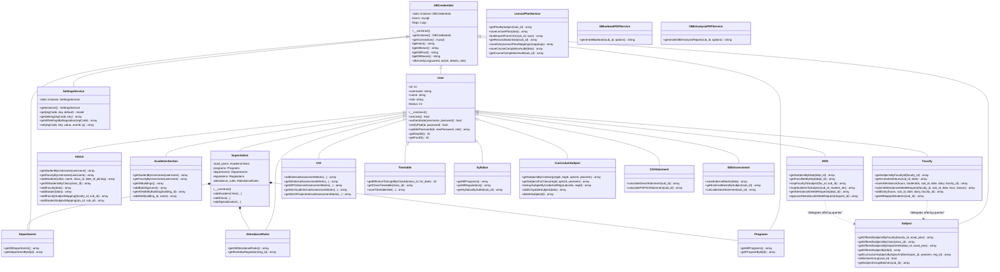

# Class Hierarchy & Object Model

This document outlines the object-oriented structure, class inheritance trees, and composition patterns used across the application models.

---

## 1. Class Inheritance Diagram

```mermaid
classDiagram
    direction TB

    class DBCredentials {
        -static instance: DBCredentials
        #conn: mysqli
        #logs: Logs
        +__construct()
        +getInstance() DBCredentials
        +getConnection() mysqli
        #getHost() string
        #getDBUser() string
        #getDBPwd() string
        #getDBName() string
        +dbActivityLog(userId, action, details, role)
    }

    class User {
        +id: int
        +username: string
        +name: string
        +role: string
        #status: int
        +__construct()
        +isActive() bool
        +authenticate(username, password) bool
        +verifyPwd(id, password) bool
        +updatePassword(id, newPassword, role) array
        +getDeptID() int
        +getFacID() int
    }

    class Departments {
        +getAllDepartments() array
        +getDepartmentById(id) array
    }

    class Programs {
        +getAllPrograms() array
        +getProgramById(id) array
    }

    class SuperAdmin {
        -acad_years: AcademicYears
        -programs: Programs
        -departments: Departments
        -regulations: Regulations
        -attendance_rules: AttendanceRules
        +__construct()
        +addAcademicYear(...)
        +addClass(...)
        +addSpecialization(...)
    }

    class Admin {
        +getStudentByUsername(username) array
        +getFacultyByUsername(username) array
        +addStudent(rollno, name, class_id, date_of_joining) array
        +getAllStudentsByClass(class_id) array
        +addFaculty(data) array
        +addSubject(data) array
        +addFacultySubjectMapping(faculty_id, sub_id) array
        +addStudentSubjectMapping(stu_id, sub_id) array
    }

    class AcademicSection {
        +getStudentByUsername(username) array
        +getFacultyByUsername(username) array
        +getAllBuildings() array
        +addBuilding(name) array
        +getAllHallsByBuilding(building_id) array
        +addHall(building_id, name) array
    }

    class HOD {
        +getSubjectsByDept(dept_id) array
        +getFacultiesByDept(dept_id) array
        +mapFacultyToSubject(fac_id, sub_id) array
        +mapStudentsToSubject(sub_id, student_ids) array
        +getAttendanceDeleteRequests(dept_id) array
        +approveAttendanceDeleteRequest(request_id) array
    }

    class Faculty {
        +getSubjectsByFacultyId(faculty_id) array
        +getUnmarkedHours(sub_id, date) array
        +markAttendance(hours, studentIds, sub_id, date, diary, faculty_id) array
        +submitAttendanceDeleteRequest(faculty_id, sub_id, date, hour, reason) array
        +addDairy(hours, sub_id, date, diary, faculty_id) array
        +getAllMappedStudents(sub_id) array
    }

    class CIA {
        +addInternalAssessmentMarks(...) array
        +getStInternalAssessmentMarks(...) array
        +getStPGInternalAssessmentMarks(...) array
        +getStUGLabInternalAssessmentMarks(...) array
        +getStUGProjectInternalAssessmentMarks(...) array
    }

    class Timetable {
        +getEffectiveTimingIdByClassId(class_id, for_date) int
        +getClassTimetable(class_id) array
        +saveTimetableSlot(...) array
    }

    class Syllabus {
        +getAllPrograms() array
        +getAllRegulations() array
        +getSyllabusBySubId(sub_id) array
    }

    class CurriculumSubject {
        +getSubjectsByContext(progId, regId, specId, yearsem) array
        +getSubjectsForClass(regId, specId, yearsem) array
        +lookupSubjectByCodeAndReg(subcode, regId) array
        +addOrUpdateSubject(data) array
        +deleteSubject(id) array
    }

    class AttendanceRules {
        +getAllAttendanceRules() array
        +getRulesByRegulation(reg_id) array
    }

    class Subject {
        +getOfferedSubjectsByFaculty(faculty_id, acad_year) array
        +getOfferedSubjectsByClass(class_id) array
        +getOfferedSubjectsByDepartment(dept_id, acad_year) array
        +getOfferedSubjectById(id) array
        +getCurriculumSubjectsBySpecAndSem(spec_id, yearsem, reg_id) array
        +isElectiveGroup(sub_id) bool
        +getSubjectGroupBatches(sub_id) array
    }

    class LessonPlanService {
        +getPlanBySubject(sub_id) array
        +saveLecturePlan(data) array
        +bulkImportFromCSV(sub_id, rows) array
        +getReconciliationData(sub_id) array
        +saveDiaryLessonPlanMappings(mappings) array
        +saveCourseCompletionAudit(data) array
        +getCourseCompletionAudit(sub_id) array
    }

    class SettingsService {
        -static instance: SettingsService
        +getInstance() SettingsService
        +get(regCode, key, default) mixed
        +getSetting(regCode, key) array
        +getAllSettingsByRegulation(regCode) array
        +set(regCode, key, value, userId, ip) array
    }

    class EBluebookPDFService {
        +generateBluebook(sub_id, options) string
    }

    class OBEAnalysisPDFService {
        +generateOBEAnalysisReport(sub_id, options) string
    }

    class COAttainment {
        +calculateDirectAttainment(sub_id) array
        +calculatePOPSOAttainment(sub_id) array
    }

    class SEEAssessment {
        +saveExternalMarks(data) array
        +getExternalMarksBySubject(sub_id) array
        +calculateSeeAttainment(sub_id) array
    }

    %% Inheritance relationships
    DBCredentials <|-- User
    DBCredentials <|-- Departments
    DBCredentials <|-- Programs
    DBCredentials <|-- Subject
    DBCredentials <|-- SettingsService

    User <|-- SuperAdmin
    User <|-- Admin
    User <|-- AcademicSection
    User <|-- HOD
    User <|-- Faculty
    User <|-- CIA
    User <|-- Timetable
    User <|-- Syllabus
    User <|-- CurriculumSubject
    User <|-- AttendanceRules
    User <|-- COAttainment
    User <|-- SEEAssessment

    %% Composition and Delegation
    SuperAdmin *-- Departments
    SuperAdmin *-- Programs
    SuperAdmin *-- AttendanceRules
    Faculty ..> Subject : "delegates offering queries"
    HOD ..> Subject : "delegates offering queries"
```

---

## 2. Base Classes Detailed

### 2.1 `DBCredentials` (`dbcredentials.class.php`)
- **Role**: Root database connection manager and activity logger.
- **Connection Pattern**: Singleton-capable MySQLi connection.
- **Environment Resolution**: Dynamically includes `dirname(__DIR__) . '/.env.php'` and binds constants `DB_HOST`, `DB_USER`, `DB_PASS`, and `DB_NAME`.
- **Database Logging**: Provides `dbActivityLog($userId, $action, $details, $role)` which branches into `activity_logs` or `fac_activity_logs`.

### 2.2 `User` (`user.class.php`)
- **Role**: Base identity and authentication service for all authenticated actors.
- **Inherits From**: `DBCredentials`.
- **Core Methods**:
  - `authenticate($username, $password)`: Checks username and password; auto-upgrades legacy MD5 hashes to BCrypt; updates last login logs.
  - `verifyPwd($id, $password)`: Checks user password before permitting password changes.
  - `updatePassword($id, $newPassword, $role)`: Hashes new password with `PASSWORD_BCRYPT` and updates `users` table.
  - `getDeptID()`: Resolves department ID for logged-in HOD.
  - `getFacID()`: Resolves faculty ID for logged-in Faculty.

---

## 3. Domain Model Subclasses

### 3.1 Role Service Models
- **`SuperAdmin`** (`superadmin.class.php`): System-wide master data manager. Configures academic years, programs, departments, specializations, classes (including section assignment via `generateClassName()`), class timings, and attendance rules. Composes instances of `Programs`, `Departments`, `Regulations`, and `AttendanceRules`.
- **`Admin`** (`admin.class.php`): Institution administrator. Enrolls students, manages faculty profiles, sets student status, maps faculty/students to subjects, and resets passwords with remarks.
- **`AcademicSection`** (`academicsection.class.php`): Academic affairs office. Manages buildings, examination halls, regulations, master curriculum subject catalogs (`CurriculumSubject`), syllabus files, and student/faculty password resets.
- **`HOD`** (`hod.class.php`): Department head. Oversees departmental subjects, assigns faculty to subjects (`faculty_sub`), maps students (`student_sub`), manages timetable schedules, reviews/approves faculty attendance deletion requests, and approves end-of-course syllabus completion audits. Delegates subject queries to `Subject`.
- **`Faculty`** (`faculty.class.php`): Instructors. Marks daily attendance with frictionless period topic logging, maintains teaching diary entries, logs exceptional attendance, submits attendance deletion requests, and submits syllabus completion compliance audits. Delegates course offering queries to `Subject`.

### 3.2 Subject Management Model
- **`Subject`** (`subject.class.php`): Dedicated service model managing active subject offerings (`subjects` table), elective choice groups, laboratory batch divisions (`subjects.group_name`), and links to master curriculum catalog courses (`curr_sub_id`). Centralizes offering retrieval across faculty, departmental, and class contexts.

### 3.3 Academic, Assessment & OBE Service Models
- **`CIA`** (`cia.class.php`): Handles Continuous Internal Assessment marks entry, calculations, condensed reports, and grade thresholds for UG, PG, Lab, and Project subjects.
- **`CIAMarks`** (`ciamarks.class.php`): Modular CIA scoring engine managing question-level entries and validation.
- **`AssessmentStructure`** (`assessmentstructure.class.php`): Configures assessment question components, Bloom taxonomy mapping, and max marks.
- **`CourseOutcome`** (`courseoutcome.class.php`): Manages Course Outcome definitions, BOS master linking (`curr_sub_id`), and cognitive level targets.
- **`COAttainment`** (`coattainment.class.php`): Computes direct and indirect CO attainment, threshold adherence, and PO-PSO attainment articulation matrices.
- **`SEEAssessment`** (`seeassessment.class.php`): Handles Semester End Examination assessment structures, detailed question-level entries, direct ledger marks, and external attainment calculation.
- **`LearningAnalytics`** (`learninganalytics.class.php`): Computes OBE learning progression, score distributions, and accreditation metrics.
- **`CIADataExchange`** (`ciadataexchange.class.php`): Manages Excel/CSV template generation, bulk import sanitization, and data export.
- **`FacCIAAnalysis2`** (`facciaanalysis2.class.php`): Active choice-aware analytical calculator for direct/indirect CO-PO attainment matrices and visual charts (legacy `facciaanalysis.class.php` has been cleaned up and removed).
- **`Timetable`** (`timetable.class.php`): Configures class timing templates, timing schedules per date ranges, weekly class timetables, and teacher allocations.
- **`Syllabus`** (`syllabus.class.php`): Uploads and retrieves curriculum regulations and syllabus units.
- **`CurriculumSubject`** (`curriculum_subject.class.php`): Academic section catalog manager for central course templates across regulations.
- **`AttendanceRules`** (`attendancerules.class.php`): Manages attendance condonation and shortage criteria based on program regulations.

### 3.4 Regulatory Policy & Lesson Plan Services
- **`SettingsService`** (`services/SettingsService.php`): Centralized singleton service providing access to regulation-specific autonomous academic parameters (`academic_settings` table), including CIA/SEE weightages, attendance thresholds, and attainment targets, backed by an immutable mutation audit log (`academic_settings_audit`).
- **`LessonPlanService`** (`services/LessonPlanService.php`): Manages lecture-by-lecture syllabus planning (`lesson_plans` table), bulk CSV upload with Bloom's level and CO sanitization, end-of-course automated reconciliation against daily teaching diary logs (`diary.lesson_plan_id`), and NBA Criterion 2.2 course completion compliance audits (`course_completion_audits` table).

### 3.5 Accreditation Dossier & Feedback Services
- **`EBluebookPDFService`** (`services/EBluebookPDFService.php`): High-fidelity PDF generation engine powered by TCPDF producing official course Bluebooks containing Section 1 (Nominal Roll), Section 2A (Lesson Plan), Section 2B (Teaching Diary of Classes), Section 2C (Course Delivery Compliance & Deviation Report), Section 3 (Attendance Register), and Section 4 (CIA Marks Register).
- **`OBEAnalysisPDFService`** (`services/OBEAnalysisPDFService.php`): Generates comprehensive NBA/NAAC Outcome-Based Education dossiers with CO formulation, CO-PO-PSO articulation matrices, question-to-CO mappings, direct/indirect attainment calculations, and visual attainment charts.
- **`FeedbackService`** (`feedbackservice.class.php`): Multi-granularity analytical service for Course Outcome (CO) indirect surveys, Course End Surveys (CES), and Student Faculty Appraisals.
- **`EnhancedPDFService`** (`services/EnhancedPDFService.php`): High-fidelity executive student feedback report generator.
- **`FeedbackExcelService`** (`services/FeedbackExcelService.php`): Multi-tab analytical workbook generator powered by PhpSpreadsheet.

