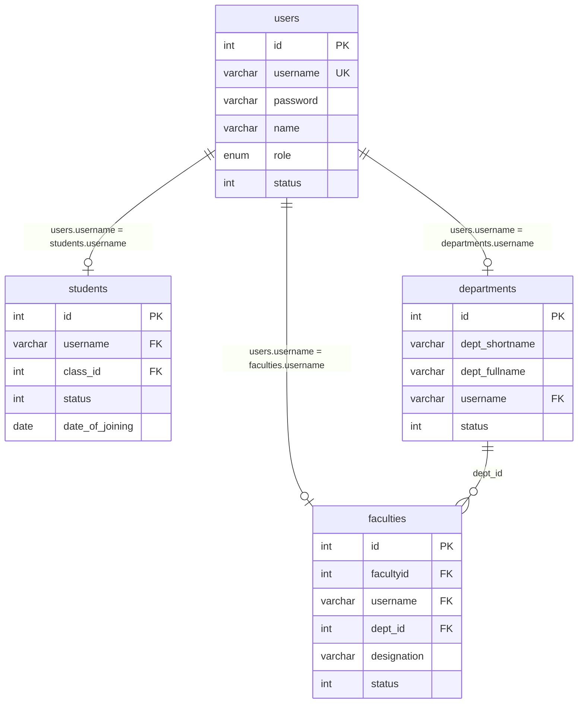
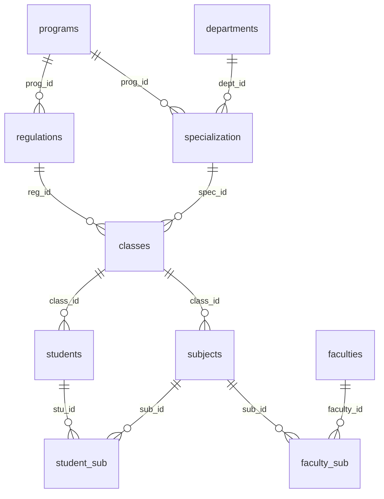
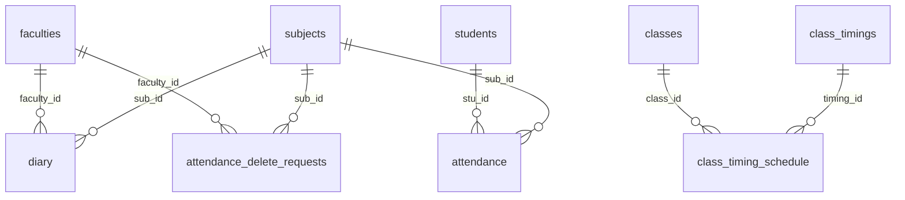
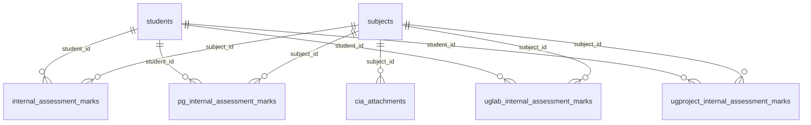
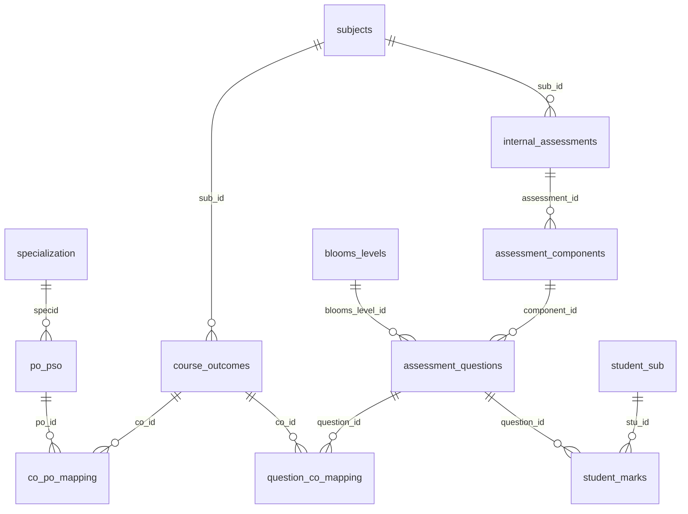

# Database Relationships & Entity-Relationship Diagrams

This document illustrates the database relationships, entity-relationship (ER) diagrams, exact foreign key constraints, and table join rules extracted from `u182589698_jntuaceasarb_database_scheme.sql`.

---

## 1. Identity & Profile Relationships

> [!IMPORTANT]
> **Critical Join Rule**: In this system, profile entities (`faculties`, `students`, `departments`) link to the `users` table via `username = username` (varchar match), not by `users.id`.
> - `students.username = users.username`
> - `faculties.username = users.username` (with optional `faculties.facultyid = users.id`)
> - `departments.username = users.username`



---

## 2. Academic Hierarchy & Enrollment



### Key Junction Mechanics:
- **Class-to-Subject**: A class contains multiple subjects (`subjects.class_id = classes.id`).
- **Student-to-Subject (`student_sub`)**: A junction table mapping individual enrolled students to specific subjects (`student_sub.stu_id = students.id` and `student_sub.sub_id = subjects.id`). This allows accurate handling of elective subjects where only a subset of students in a class attend.
- **Faculty-to-Subject (`faculty_sub`)**: A junction table assigning instructors to courses (`faculty_sub.faculty_id = faculties.id` and `faculty_sub.sub_id = subjects.id`).

---

## 3. Attendance, Diary & Deletion Workflow



### Key Attendance Constraints & Invariants:
1. **Attendance Marking**:
   ```sql
   -- Students marked present/absent for a given period
   INSERT INTO attendance (stu_id, sub_id, date, hour, status) VALUES (?, ?, ?, ?, ?);
   ```
2. **Teaching Diary Alignment**:
   ```sql
   -- Faculty logs what was taught during that exact period
   INSERT INTO diary (sub_id, faculty_id, date, hour, diary) VALUES (?, ?, ?, ?, ?);
   ```
3. **Deletion/Correction Chain**:
   When faculty mark wrong hours or duplicate entries, a record is entered into `attendance_delete_requests`:
   - `sub_id`, `date`, `hour` identify the targeted period.
   - Upon HOD approval, records matching `(sub_id, date, hour)` are deleted from `attendance` and `diary`.

---

## 4. Assessment & Continuous Internal Assessment (CIA)



---

## 5. Outcome-Based Education (OBE) & Attainment



---

## 6. Explicit Foreign Key Constraints Table

Directly transcribed from `u182589698_jntuaceasarb_database_scheme.sql`:

| Table | Constraint Symbol | Foreign Key Column | Target Table & Column | Cascade / Action |
|---|---|---|---|---|
| `attendance_rules` | `reg_atte_fk1` | `reg_id` | `regulations(id)` | - |
| `classes` | `classes_ibfk_1` | `spec_id` | `specialization(id)` | ON UPDATE CASCADE |
| `classes` | `classes_reg_fk1` | `reg_id` | `regulations(id)` | - |
| `class_timing_schedule` | `fk_cts_class` | `class_id` | `classes(id)` | ON DELETE CASCADE |
| `class_timing_schedule` | `fk_cts_timing` | `timing_id` | `class_timings(timing_id)` | - |
| `course_outcomes` | `course_outcomes_ibfk_1` | `sub_id` | `subjects(id)` | - |
| `co_po_mapping` | `co_po_mapping_ibfk_1` | `co_id` | `course_outcomes(id)` | ON DELETE CASCADE |
| `co_po_mapping` | `co_po_mapping_ibfk_2` | `po_id` | `po_pso(id)` | ON DELETE CASCADE |
| `diary` | `diary_ibfk_1` | `faculty_id` | `faculties(id)` | ON UPDATE CASCADE |
| `diary` | `diary_ibfk_2` | `sub_id` | `subjects(id)` | ON UPDATE CASCADE |
| `faculties` | `faculties_ibfk_1` | `facultyid` | `users(id)` | ON UPDATE CASCADE |
| `faculties` | `faculties_ibfk_2` | `username` | `users(username)` | ON UPDATE CASCADE |
| `faculties` | `faculties_ibfk_3` | `dept_id` | `departments(id)` | ON UPDATE CASCADE |
| `faculty_sub` | `faculty_sub_ibfk_2` | `faculty_id` | `faculties(id)` | ON UPDATE CASCADE |
| `faculty_sub` | `faculty_sub_ibfk_3` | `sub_id` | `subjects(id)` | ON UPDATE CASCADE |
| `fac_activity_logs` | `fac_activity_logs_ibfk_1` | `user_id` | `faculties(id)` | ON DELETE CASCADE ON UPDATE CASCADE |
| `halls` | `halls_ibfk_1` | `building_id` | `buildings(id)` | ON DELETE CASCADE |
| `internal_assessments` | `internal_assessments_ibfk_1` | `sub_id` | `subjects(id)` | - |
| `internal_assessment_marks` | `internal_assessment_marks_ibfk_1` | `student_id` | `students(id)` | - |
| `internal_assessment_marks` | `internal_assessment_marks_ibfk_2` | `subject_id` | `subjects(id)` | - |
| `po_pso` | `po_pso_ibfk_1` | `specid` | `specialization(id)` | - |
| `question_co_mapping` | `question_co_mapping_ibfk_1` | `question_id` | `assessment_questions(id)` | - |
| `question_co_mapping` | `question_co_mapping_ibfk_2` | `co_id` | `course_outcomes(id)` | - |
| `regulations` | `reg_prg_fk1` | `prog_id` | `programs(id)` | - |
| `specialization` | `specialization_ibfk_3` | `dept_id` | `departments(id)` | ON UPDATE CASCADE |
| `specialization` | `specialization_ibfk_4` | `prog_id` | `programs(id)` | ON UPDATE CASCADE |
| `students` | `students_ibfk_1` | `class_id` | `classes(id)` | ON UPDATE CASCADE |
| `students` | `students_ibfk_2` | `username` | `users(username)` | ON UPDATE CASCADE |
| `student_co_feedback` | `student_co_feedback_ibfk_1` | `student_id` | `students(id)` | - |
| `student_co_feedback` | `student_co_feedback_ibfk_2` | `subject_id` | `subjects(id)` | - |
| `student_co_feedback` | `student_co_feedback_ibfk_3` | `class_id` | `classes(id)` | - |
| `student_co_feedback` | `student_co_feedback_ibfk_4` | `co_id` | `course_outcomes(id)` | - |
| `student_marks` | `student_marks_ibfk_1` | `stu_id` | `student_sub(stu_id)` | - |
| `student_marks` | `student_marks_ibfk_3` | `question_id` | `assessment_questions(id)` | - |
| `student_questionnaire_responses`| `student_questionnaire_responses_ibfk_1`| `student_id` | `students(id)` | ON DELETE CASCADE ON UPDATE CASCADE |
| `student_questionnaire_responses`| `student_questionnaire_responses_ibfk_2`| `subject_id` | `subjects(id)` | ON DELETE CASCADE ON UPDATE CASCADE |
| `student_questionnaire_responses`| `student_questionnaire_responses_ibfk_3`| `question_id` | `subject_questionnaire_questions(id)` | ON DELETE CASCADE ON UPDATE CASCADE |
| `student_sub` | `student_sub_ibfk_3` | `stu_id` | `students(id)` | ON DELETE CASCADE ON UPDATE CASCADE |
| `student_sub` | `student_sub_ibfk_4` | `sub_id` | `subjects(id)` | ON UPDATE CASCADE |
| `subjects` | `subjects_ibfk_1` | `class_id` | `classes(id)` | ON UPDATE CASCADE |
| `subject_questionnaire_questions`| `subject_questionnaire_questions_ibfk_1`| `subject_id` | `subjects(id)` | ON DELETE CASCADE ON UPDATE CASCADE |
| `subject_questionnaire_questions`| `subject_questionnaire_questions_ibfk_2`| `created_by_user_id` | `users(id)` | ON UPDATE CASCADE |
