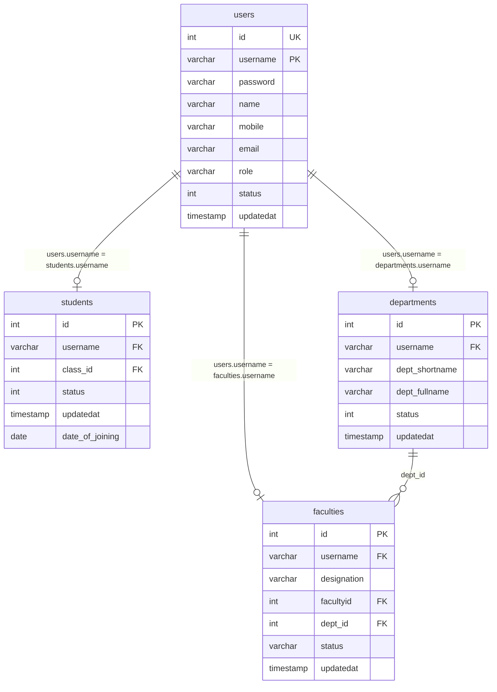
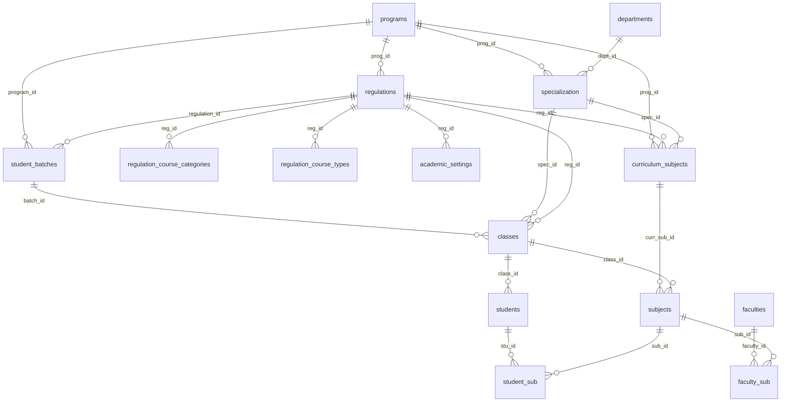
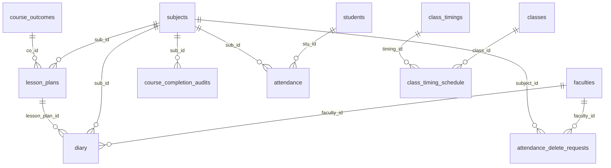
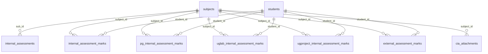
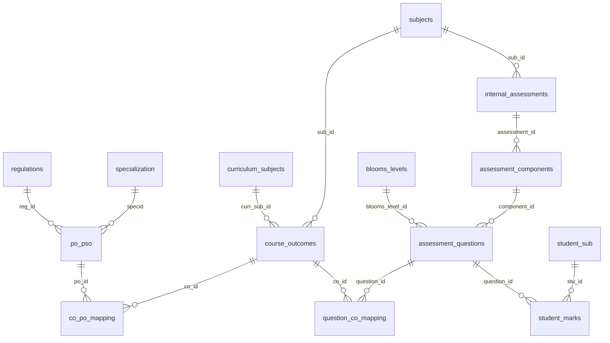
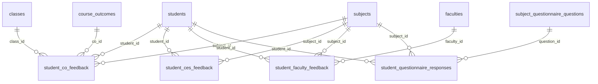
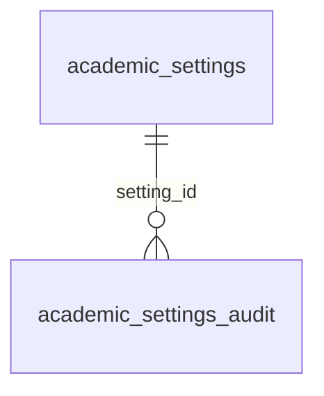
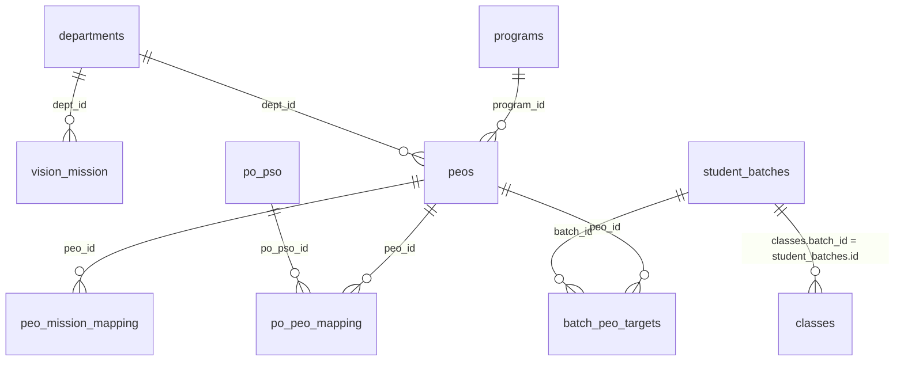
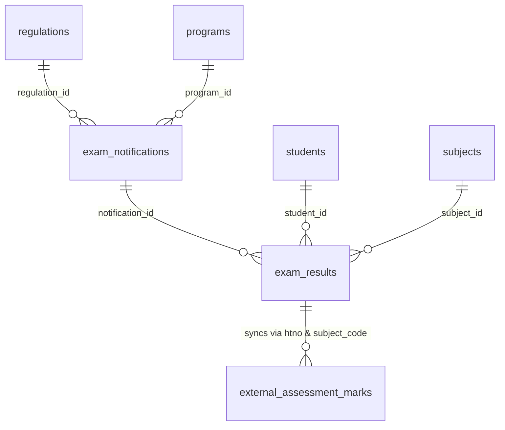
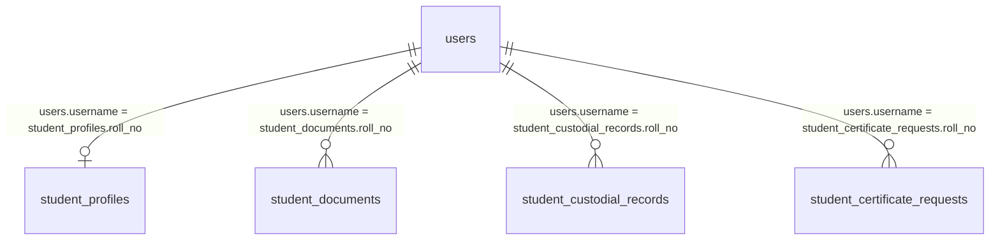

# Database Relationships & Entity-Relationship Diagrams

This document illustrates the database relationships, entity-relationship (ER) diagrams, exact foreign key constraints, and table join rules extracted directly from the system database schema (68 tables, covering 10 functional domains).

---

## 1. Identity & Profile Relationships

> [!IMPORTANT]
> **Critical Join Rule**: In this system, profile entities (`faculties`, `students`, `departments`) link to the `users` table via `username = username` (varchar match), not by `users.id`.
> - `students.username = users.username`
> - `faculties.username = users.username` (with optional `faculties.facultyid = users.id`)
> - `departments.username = users.username`


```mermaid
erDiagram
    users {
        int id UK
        varchar username PK
        varchar password
        varchar name
        varchar mobile
        varchar email
        varchar role
        int status
        timestamp updatedat
    }

    faculties {
        int id PK
        varchar username FK
        varchar designation
        int facultyid FK
        int dept_id FK
        varchar status
        timestamp updatedat
    }

    students {
        int id PK
        varchar username FK
        int class_id FK
        int status
        timestamp updatedat
        date date_of_joining
    }

    departments {
        int id PK
        varchar username FK
        varchar dept_shortname
        varchar dept_fullname
        int status
        timestamp updatedat
    }

    users ||--o| faculties : "users.username = faculties.username"
    users ||--o| students : "users.username = students.username"
    users ||--o| departments : "users.username = departments.username"
    departments ||--o{ faculties : "dept_id"
```

---

## 2. Academic Hierarchy & Enrollment


```mermaid
erDiagram
    programs ||--o{ regulations : "prog_id"
    programs ||--o{ specialization : "prog_id"
    departments ||--o{ specialization : "dept_id"
    programs ||--o{ student_batches : "program_id"
    regulations ||--o{ student_batches : "regulation_id"
    student_batches ||--o{ classes : "batch_id"
    specialization ||--o{ classes : "spec_id"
    regulations ||--o{ classes : "reg_id"
    
    regulations ||--o{ regulation_course_categories : "reg_id"
    regulations ||--o{ regulation_course_types : "reg_id"
    regulations ||--o{ academic_settings : "reg_id"

    programs ||--o{ curriculum_subjects : "prog_id"
    regulations ||--o{ curriculum_subjects : "reg_id"
    specialization ||--o{ curriculum_subjects : "spec_id"
    curriculum_subjects ||--o{ subjects : "curr_sub_id"

    classes ||--o{ students : "class_id"
    classes ||--o{ subjects : "class_id"

    students ||--o{ student_sub : "stu_id"
    subjects ||--o{ student_sub : "sub_id"

    faculties ||--o{ faculty_sub : "faculty_id"
    subjects ||--o{ faculty_sub : "sub_id"
```

### Key Junction Mechanics:
- **Regulation to Categories & Types**: SuperAdmin defines statutory parameters, degree credit targets (`regulations`), statutory category credit limits (`regulation_course_categories.reg_id = regulations.id`), and canonical assessment schemes (`regulation_course_types.reg_id = regulations.id`). Policy parameters are scoped via `academic_settings.reg_id = regulations.id`.
- **Class-to-Subject**: A class contains multiple subjects (`subjects.class_id = classes.id`). Classes also support optional sections (`classes.section`) and batch cohort tracking (`classes.batch_id`).
- **Subject-to-Curriculum Master**: Subject offerings optionally link to the master catalog (`subjects.curr_sub_id = curriculum_subjects.id`), allowing standardized credits, lecture hours, delivery modes, and syllabus names across academic years. Elective groups and multi-batches are separated by `subjects.group_name`.
- **Student-to-Subject (`student_sub`)**: A junction table mapping individual enrolled students to specific subjects (`student_sub.stu_id = students.id` and `student_sub.sub_id = subjects.id`). This allows accurate handling of elective subjects where only a subset of students in a class attend.
- **Faculty-to-Subject (`faculty_sub`)**: A junction table assigning instructors to courses (`faculty_sub.faculty_id = faculties.id` and `faculty_sub.sub_id = subjects.id`).

---

## 3. Attendance, Diary, Lesson Plans & Course Audit Workflow


```mermaid
erDiagram
    faculties ||--o{ diary : "faculty_id"
    subjects ||--o{ diary : "sub_id"
    lesson_plans ||--o{ diary : "lesson_plan_id"

    subjects ||--o{ lesson_plans : "sub_id"
    course_outcomes ||--o{ lesson_plans : "co_id"

    subjects ||--o{ course_completion_audits : "sub_id"

    students ||--o{ attendance : "stu_id"
    subjects ||--o{ attendance : "sub_id"

    faculties ||--o{ attendance_delete_requests : "faculty_id"
    subjects ||--o{ attendance_delete_requests : "subject_id"

    classes ||--o{ class_timing_schedule : "class_id"
    class_timings ||--o{ class_timing_schedule : "timing_id"
```

### Key Attendance Constraints & Invariants:
1. **Attendance Marking**:
   ```sql
   -- Students marked present/absent for a given period
   INSERT INTO attendance (stu_id, sub_id, date, hour, status) VALUES (?, ?, ?, ?, ?);
   ```
2. **Teaching Diary Alignment**:
   ```sql
   -- Faculty logs what was taught during that exact period
   INSERT INTO diary (sub_id, faculty_id, date, hour, diary) VALUES (?, ?, ?, ?, ?);
   ```
3. **Lesson Plan Reconciliation & Audit**:
   Teaching diary records link to scheduled lesson plan entries via `diary.lesson_plan_id = lesson_plans.id`. Course completion metrics, unit milestone dates, deviations, and compensatory classes are stored in `course_completion_audits` for NBA 2.2 compliance.
4. **Deletion/Correction Chain**:
   When faculty mark wrong hours or duplicate entries, a record is entered into `attendance_delete_requests`:
   - `subject_id`, `date`, `hour` identify the targeted period.
   - Upon HOD approval, records matching `(subject_id, date, hour)` are deleted from `attendance` and `diary`.

---

## 4. Assessment: Continuous Internal (CIA) & External (SEE)


```mermaid
erDiagram
    subjects ||--o{ internal_assessments : "sub_id"

    subjects ||--o{ internal_assessment_marks : "subject_id"
    students ||--o{ internal_assessment_marks : "student_id"

    subjects ||--o{ pg_internal_assessment_marks : "subject_id"
    students ||--o{ pg_internal_assessment_marks : "student_id"

    subjects ||--o{ uglab_internal_assessment_marks : "subject_id"
    students ||--o{ uglab_internal_assessment_marks : "student_id"

    subjects ||--o{ ugproject_internal_assessment_marks : "subject_id"
    students ||--o{ ugproject_internal_assessment_marks : "student_id"

    subjects ||--o{ external_assessment_marks : "subject_id"
    students ||--o{ external_assessment_marks : "student_id"

    subjects ||--o{ cia_attachments : "subject_id"
```

---

## 5. Outcome-Based Education (OBE) & Attainment


```mermaid
erDiagram
    subjects ||--o{ course_outcomes : "sub_id"
    curriculum_subjects ||--o{ course_outcomes : "curr_sub_id"
    specialization ||--o{ po_pso : "specid"
    regulations ||--o{ po_pso : "reg_id"

    course_outcomes ||--o{ co_po_mapping : "co_id"
    po_pso ||--o{ co_po_mapping : "po_id"

    subjects ||--o{ internal_assessments : "sub_id"
    internal_assessments ||--o{ assessment_components : "assessment_id"
    assessment_components ||--o{ assessment_questions : "component_id"
    blooms_levels ||--o{ assessment_questions : "blooms_level_id"

    assessment_questions ||--o{ question_co_mapping : "question_id"
    course_outcomes ||--o{ question_co_mapping : "co_id"

    student_sub ||--o{ student_marks : "stu_id"
    assessment_questions ||--o{ student_marks : "question_id"
```

---

## 6. Student Surveys & Institutional Feedback


```mermaid
erDiagram
    students ||--o{ student_co_feedback : "student_id"
    subjects ||--o{ student_co_feedback : "subject_id"
    classes ||--o{ student_co_feedback : "class_id"
    course_outcomes ||--o{ student_co_feedback : "co_id"

    students ||--o{ student_ces_feedback : "student_id"
    subjects ||--o{ student_ces_feedback : "subject_id"

    students ||--o{ student_faculty_feedback : "student_id"
    subjects ||--o{ student_faculty_feedback : "subject_id"
    faculties ||--o{ student_faculty_feedback : "faculty_id"

    students ||--o{ student_questionnaire_responses : "student_id"
    subjects ||--o{ student_questionnaire_responses : "subject_id"
    subject_questionnaire_questions ||--o{ student_questionnaire_responses : "question_id"
```

### Feedback Survey Architecture:
- **Course Outcome Indirect Feedback (`student_co_feedback`)**: Captures student evaluation per Course Outcome (`co_id`). Feeds into indirect attainment calculation (threshold $\ge 3.0$ / $60\%$).
- **Course End Survey (`student_ces_feedback`)**: Captures comprehensive 16-item survey evaluating Curriculum, Teaching Process, Evaluation, Learning Resources, and Outcome Mastery, along with qualitative observations.
- **Faculty Appraisal (`student_faculty_feedback`)**: Captures 19-criterion evaluation of instructional quality, pedagogical clarity, fairness, and mentoring. Preserves strict anonymity with default `is_anonymous = 1`.
- **Subject Questionnaire (`student_questionnaire_responses`)**: Legacy per-subject custom question response ratings linked to `subject_questionnaire_questions`.

---

## 7. Autonomous Academic Settings & Audit


```mermaid
erDiagram
    academic_settings ||--o{ academic_settings_audit : "setting_id"
```

- **Dynamic Policy Parameters**: `academic_settings` provides regulation-scoped configurable rules (e.g., CIA theory best/worst weightages 80:20 vs 75:25, attendance detention/condonation limits, target attainment thresholds).
- **Immutable Mutation Audit**: Every edit to an academic setting creates an audit row in `academic_settings_audit` capturing the user, previous value, new value, timestamp, and IP address.

---

## 8. Explicit Foreign Key Constraints Table

Directly verified against the system database schema (all 71 active foreign key constraints):

| Table | Constraint Symbol | Foreign Key Column | Target Table & Column | Cascade / Action |
|---|---|---|---|---|
| `academic_settings_audit` | `fk_academic_settings_audit_setting` | `setting_id` | `academic_settings(id)` | ON DELETE CASCADE ON UPDATE CASCADE |
| `activity_logs` | `activity_logs_ibfk_1` | `user_id` | `users(id)` | - |
| `assessment_components` | `assessment_components_ibfk_1` | `assessment_id` | `internal_assessments(id)` | - |
| `assessment_questions` | `assessment_questions_ibfk_3` | `blooms_level_id` | `blooms_levels(id)` | - |
| `assessment_questions` | `assessment_questions_ibfk_2` | `component_id` | `assessment_components(id)` | - |
| `attendance` | `attendance_ibfk_1` | `stu_id` | `students(id)` | ON UPDATE CASCADE |
| `attendance` | `attendance_ibfk_2` | `sub_id` | `subjects(id)` | ON UPDATE CASCADE |
| `attendance_delete_requests` | `attendance_delete_requests_ibfk_1` | `faculty_id` | `faculties(id)` | - |
| `attendance_delete_requests` | `attendance_delete_requests_ibfk_2` | `subject_id` | `subjects(id)` | ON DELETE CASCADE ON UPDATE CASCADE |
| `attendance_rules` | `reg_atte_fk1` | `reg_id` | `regulations(id)` | - |
| `cia_attachments` | `fk_cia_att_subject` | `subject_id` | `subjects(id)` | ON DELETE CASCADE ON UPDATE CASCADE |
| `classes` | `fk_classes_batch` | `batch_id` | `student_batches(id)` | ON DELETE SET NULL ON UPDATE CASCADE |
| `classes` | `classes_reg_fk1` | `reg_id` | `regulations(id)` | - |
| `classes` | `classes_ibfk_1` | `spec_id` | `specialization(id)` | ON UPDATE CASCADE |
| `class_timing_schedule` | `fk_cts_class` | `class_id` | `classes(id)` | ON DELETE CASCADE |
| `class_timing_schedule` | `fk_cts_timing` | `timing_id` | `class_timings(timing_id)` | - |
| `course_completion_audits` | `fk_cca_sub` | `sub_id` | `subjects(id)` | ON DELETE CASCADE ON UPDATE CASCADE |
| `course_outcomes` | `fk_co_curr_sub` | `curr_sub_id` | `curriculum_subjects(id)` | ON DELETE CASCADE ON UPDATE CASCADE |
| `course_outcomes` | `course_outcomes_ibfk_1` | `sub_id` | `subjects(id)` | - |
| `co_po_mapping` | `co_po_mapping_ibfk_1` | `co_id` | `course_outcomes(id)` | ON DELETE CASCADE |
| `co_po_mapping` | `co_po_mapping_ibfk_2` | `po_id` | `po_pso(id)` | ON DELETE CASCADE |
| `curriculum_subjects` | `fk_curr_prog` | `prog_id` | `programs(id)` | ON DELETE CASCADE ON UPDATE CASCADE |
| `curriculum_subjects` | `fk_curr_reg` | `reg_id` | `regulations(id)` | ON DELETE CASCADE ON UPDATE CASCADE |
| `curriculum_subjects` | `fk_curr_spec` | `spec_id` | `specialization(id)` | ON DELETE CASCADE ON UPDATE CASCADE |
| `departments` | `departments_ibfk_1` | `username` | `users(username)` | ON DELETE CASCADE ON UPDATE CASCADE |
| `diary` | `diary_ibfk_1` | `faculty_id` | `faculties(id)` | ON UPDATE CASCADE |
| `diary` | `diary_ibfk_2` | `sub_id` | `subjects(id)` | ON UPDATE CASCADE |
| `external_assessment_marks` | `fk_see_student` | `student_id` | `students(id)` | ON DELETE CASCADE ON UPDATE CASCADE |
| `external_assessment_marks` | `fk_see_subject` | `subject_id` | `subjects(id)` | ON DELETE CASCADE ON UPDATE CASCADE |
| `faculties` | `faculties_ibfk_3` | `dept_id` | `departments(id)` | ON UPDATE CASCADE |
| `faculties` | `faculties_ibfk_1` | `facultyid` | `users(id)` | ON UPDATE CASCADE |
| `faculties` | `faculties_ibfk_2` | `username` | `users(username)` | ON DELETE CASCADE ON UPDATE CASCADE |
| `faculty_sub` | `faculty_sub_ibfk_2` | `faculty_id` | `faculties(id)` | ON UPDATE CASCADE |
| `faculty_sub` | `faculty_sub_ibfk_3` | `sub_id` | `subjects(id)` | ON UPDATE CASCADE |
| `fac_activity_logs` | `fac_activity_logs_ibfk_1` | `user_id` | `faculties(id)` | ON DELETE CASCADE ON UPDATE CASCADE |
| `halls` | `halls_ibfk_1` | `building_id` | `buildings(id)` | ON DELETE CASCADE |
| `internal_assessments` | `internal_assessments_ibfk_1` | `sub_id` | `subjects(id)` | - |
| `internal_assessment_marks` | `internal_assessment_marks_ibfk_1` | `student_id` | `students(id)` | - |
| `internal_assessment_marks` | `internal_assessment_marks_ibfk_2` | `subject_id` | `subjects(id)` | - |
| `lesson_plans` | `fk_lp_co` | `co_id` | `course_outcomes(id)` | ON UPDATE CASCADE |
| `lesson_plans` | `fk_lp_subject` | `sub_id` | `subjects(id)` | ON DELETE CASCADE ON UPDATE CASCADE |
| `po_pso` | `po_pso_ibfk_1` | `specid` | `specialization(id)` | - |
| `question_co_mapping` | `question_co_mapping_ibfk_2` | `co_id` | `course_outcomes(id)` | - |
| `question_co_mapping` | `question_co_mapping_ibfk_1` | `question_id` | `assessment_questions(id)` | - |
| `regulations` | `reg_prg_fk1` | `prog_id` | `programs(id)` | - |
| `specialization` | `specialization_ibfk_3` | `dept_id` | `departments(id)` | ON UPDATE CASCADE |
| `specialization` | `specialization_ibfk_4` | `prog_id` | `programs(id)` | ON UPDATE CASCADE |
| `students` | `students_ibfk_1` | `class_id` | `classes(id)` | ON UPDATE CASCADE |
| `students` | `students_ibfk_2` | `username` | `users(username)` | ON DELETE CASCADE ON UPDATE CASCADE |
| `student_batches` | `fk_sb_program` | `program_id` | `programs(id)` | ON UPDATE CASCADE |
| `student_batches` | `fk_sb_regulation` | `regulation_id` | `regulations(id)` | ON UPDATE CASCADE |
| `student_ces_feedback` | `fk_ces_student` | `student_id` | `students(id)` | ON DELETE CASCADE ON UPDATE CASCADE |
| `student_ces_feedback` | `fk_ces_subject` | `subject_id` | `subjects(id)` | ON DELETE CASCADE ON UPDATE CASCADE |
| `student_co_feedback` | `student_co_feedback_ibfk_3` | `class_id` | `classes(id)` | - |
| `student_co_feedback` | `student_co_feedback_ibfk_4` | `co_id` | `course_outcomes(id)` | - |
| `student_co_feedback` | `student_co_feedback_ibfk_1` | `student_id` | `students(id)` | - |
| `student_co_feedback` | `student_co_feedback_ibfk_2` | `subject_id` | `subjects(id)` | - |
| `student_faculty_feedback` | `fk_facfb_faculty` | `faculty_id` | `faculties(id)` | ON DELETE CASCADE ON UPDATE CASCADE |
| `student_faculty_feedback` | `fk_facfb_student` | `student_id` | `students(id)` | ON DELETE CASCADE ON UPDATE CASCADE |
| `student_faculty_feedback` | `fk_facfb_subject` | `subject_id` | `subjects(id)` | ON DELETE CASCADE ON UPDATE CASCADE |
| `student_marks` | `student_marks_ibfk_3` | `question_id` | `assessment_questions(id)` | - |
| `student_marks` | `student_marks_ibfk_1` | `stu_id` | `students(id)` | ON DELETE CASCADE ON UPDATE CASCADE |
| `student_questionnaire_responses` | `student_questionnaire_responses_ibfk_3` | `question_id` | `subject_questionnaire_questions(id)` | ON DELETE CASCADE ON UPDATE CASCADE |
| `student_questionnaire_responses` | `student_questionnaire_responses_ibfk_1` | `student_id` | `students(id)` | ON DELETE CASCADE ON UPDATE CASCADE |
| `student_questionnaire_responses` | `student_questionnaire_responses_ibfk_2` | `subject_id` | `subjects(id)` | ON DELETE CASCADE ON UPDATE CASCADE |
| `student_sub` | `student_sub_ibfk_3` | `stu_id` | `students(id)` | ON DELETE CASCADE ON UPDATE CASCADE |
| `student_sub` | `student_sub_ibfk_4` | `sub_id` | `subjects(id)` | ON UPDATE CASCADE |
| `subjects` | `subjects_ibfk_1` | `class_id` | `classes(id)` | ON UPDATE CASCADE |
| `subjects` | `fk_subjects_curriculum` | `curr_sub_id` | `curriculum_subjects(id)` | ON DELETE SET NULL ON UPDATE CASCADE |
| `subject_questionnaire_questions` | `subject_questionnaire_questions_ibfk_2` | `created_by_user_id` | `users(id)` | ON UPDATE CASCADE |
| `subject_questionnaire_questions` | `subject_questionnaire_questions_ibfk_1` | `subject_id` | `subjects(id)` | ON DELETE CASCADE ON UPDATE CASCADE |
| `classes` | `fk_classes_batch` | `batch_id` | `student_batches(id)` | ON DELETE SET NULL ON UPDATE CASCADE |
| `vision_mission` | `fk_vm_dept` | `dept_id` | `departments(id)` | ON DELETE CASCADE ON UPDATE CASCADE |
| `peos` | `fk_peos_dept` | `dept_id` | `departments(id)` | ON DELETE CASCADE ON UPDATE CASCADE |
| `peos` | `fk_peos_prog` | `program_id` | `programs(id)` | ON DELETE CASCADE ON UPDATE CASCADE |
| `peo_mission_mapping` | `fk_pmm_peo` | `peo_id` | `peos(id)` | ON DELETE CASCADE ON UPDATE CASCADE |
| `po_peo_mapping` | `fk_ppm_popso` | `po_pso_id` | `po_pso(id)` | ON DELETE CASCADE ON UPDATE CASCADE |
| `po_peo_mapping` | `fk_ppm_peo` | `peo_id` | `peos(id)` | ON DELETE CASCADE ON UPDATE CASCADE |
| `batch_peo_targets` | `fk_bpt_batch` | `batch_id` | `student_batches(id)` | ON DELETE CASCADE ON UPDATE CASCADE |
| `batch_peo_targets` | `fk_bpt_peo` | `peo_id` | `peos(id)` | ON DELETE CASCADE ON UPDATE CASCADE |
| `exam_notifications` | `fk_en_regulation` | `regulation_id` | `regulations(id)` | ON UPDATE CASCADE |
| `exam_notifications` | `fk_en_program` | `program_id` | `programs(id)` | ON UPDATE CASCADE |
| `exam_results` | `fk_er_notification` | `notification_id` | `exam_notifications(id)` | ON DELETE CASCADE ON UPDATE CASCADE |
| `exam_results` | `fk_er_student` | `student_id` | `students(id)` | ON DELETE SET NULL ON UPDATE CASCADE |
| `exam_results` | `fk_er_subject` | `subject_id` | `subjects(id)` | ON DELETE SET NULL ON UPDATE CASCADE |
| `student_profiles` | `fk_sp_user` | `roll_no` | `users(username)` | ON DELETE CASCADE ON UPDATE CASCADE |
| `student_documents` | `fk_sd_user` | `roll_no` | `users(username)` | ON DELETE CASCADE ON UPDATE CASCADE |
| `student_custodial_records` | `fk_scr_user` | `roll_no` | `users(username)` | ON DELETE CASCADE ON UPDATE CASCADE |
| `student_certificate_requests` | `fk_sc_req_user` | `roll_no` | `users(username)` | ON DELETE CASCADE ON UPDATE CASCADE |

---

## 9. Master OBE Hierarchy & Batch Cohort Inheritance Relationships


```mermaid
erDiagram
    departments ||--o{ vision_mission : "dept_id"
    departments ||--o{ peos : "dept_id"
    programs ||--o{ peos : "program_id"
    peos ||--o{ peo_mission_mapping : "peo_id"
    po_pso ||--o{ po_peo_mapping : "po_pso_id"
    peos ||--o{ po_peo_mapping : "peo_id"
    student_batches ||--o{ classes : "classes.batch_id = student_batches.id"
    student_batches ||--o{ batch_peo_targets : "batch_id"
    peos ||--o{ batch_peo_targets : "peo_id"
```

- `vision_mission` stores institutional and departmental Vision and parsed Mission statements ($M_1, M_2, \dots$) as master standards.
- `peos` defines Program Educational Objectives at the department/program level.
- `peo_mission_mapping` forms the articulation correlation matrix between master PEOs and Mission statements.
- `po_peo_mapping` links NBA Graduate Attributes / PSOs (`po_pso`) to master PEOs with weight levels ($0, 1, 2, 3$).
- `student_batches` inherits these master definitions by department and admission year without duplicating text records.
- `batch_peo_targets` allows cohorts to optionally specify custom target score overrides for specific PEOs.

---

## 10. Examination Results Publication & SEE Auto-Sync Relationships


```mermaid
erDiagram
    regulations ||--o{ exam_notifications : "regulation_id"
    programs ||--o{ exam_notifications : "program_id"
    exam_notifications ||--o{ exam_results : "notification_id"
    students ||--o{ exam_results : "student_id"
    subjects ||--o{ exam_results : "subject_id"
    exam_results ||--o{ external_assessment_marks : "syncs via htno & subject_code"
```

- `exam_notifications` governs the publication lifecycle, release date, and visibility of semester examination results.
- `exam_results` stores individual course grades, numerical internal/external marks, grade points, and registered/earned credits per student.
- `external_assessment_marks` receives automated syncs from `exam_results` using matching `htno` and `subject_code` under Mode C direct ledger entry.

---

## 11. Student Dossier, Vault, Physical Custody & Statutory Certificates


```mermaid
erDiagram
    users ||--o| student_profiles : "users.username = student_profiles.roll_no"
    users ||--o{ student_documents : "users.username = student_documents.roll_no"
    users ||--o{ student_custodial_records : "users.username = student_custodial_records.roll_no"
    users ||--o{ student_certificate_requests : "users.username = student_certificate_requests.roll_no"
```

- `student_profiles` expands the core `users` record into an institutional dossier with biographical, parental, reservation, entrance rank, and residential data.
- `student_documents` manages digital uploads of verified certificates (PDF/PNG/JPG) with size limits and verification timestamps.
- `student_custodial_records` acts as an auditable physical ledger for original certificates deposited during admission, tracking temporary checkouts (e.g. passport/visa applications) and reconciliation.
- `student_certificate_requests` processes student applications for Custodial, Bonafide, Study & Conduct, Transfer (TC), and No Dues clearance certificates.
