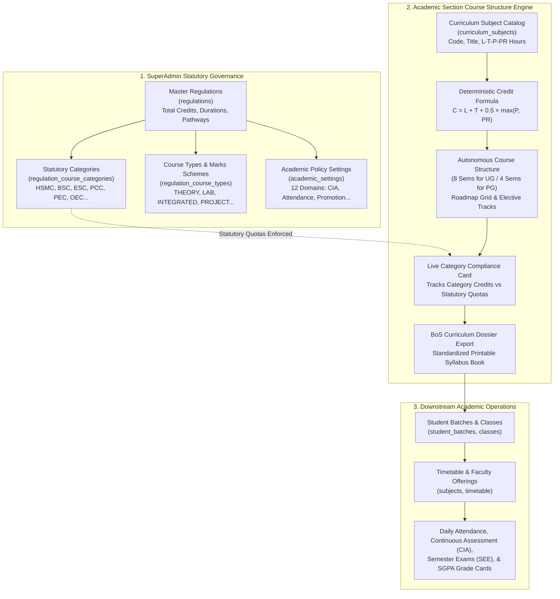
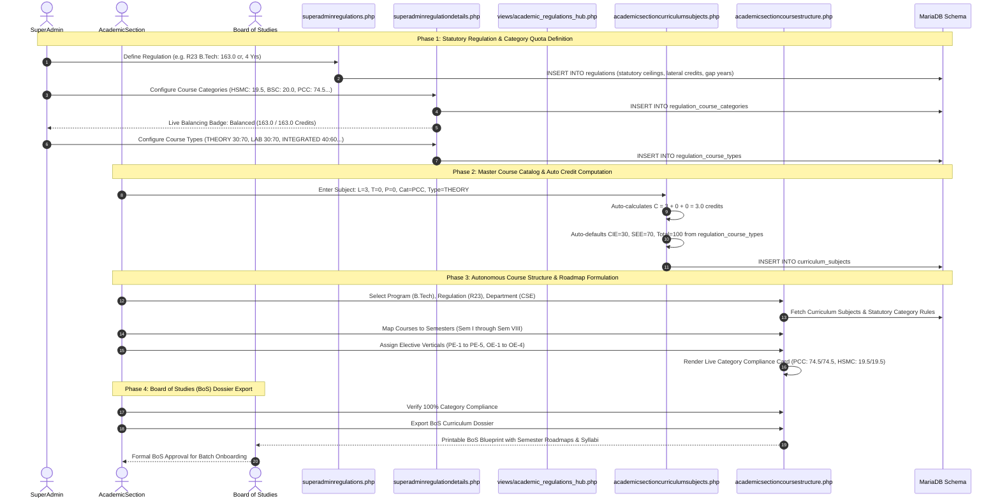

# Academic Regulations Governance & Autonomous Course Structure Engine Workflow

This document details the complete end-to-end operational and statutory workflow for the **Academic Regulations Governance** and **Autonomous Course Structure Engine** in **JNTUACEA**.

---

## 1. Overview & Statutory Authority Separation

In an autonomous university environment, academic curriculum management is strictly divided into two distinct institutional authorities:

```
┌────────────────────────────────────────────────────────┐
│             SuperAdmin (Statutory Authority)           │
│  - Establishes Academic Regulations & Degree Ceilings   │
│  - Fixes Category Credit Quotas & Balance Invariants   │
│  - Configures Evaluation Schemes & Passing Standards   │
│  - Seeds Policy Rules across 12 Regulatory Domains     │
└───────────────────────────┬────────────────────────────┘
                            │ Governs & Enforces
                            ▼
┌────────────────────────────────────────────────────────┐
│         Academic Section (Curriculum Implementation)   │
│  - Curates Master Curriculum Subject Catalog           │
│  - Computes AICTE/UGC Deterministic Credits            │
│  - Builds Semester-by-Semester Course Structures       │
│  - Validates Live Category Compliance Cards            │
│  - Organizes Elective Tracks & Exports BoS Dossiers    │
└────────────────────────────────────────────────────────┘
```

1. **SuperAdmin (Statutory Governance)**:
   - Acts on behalf of the University Academic Council and Governing Body.
   - Formulates the overarching statutory framework: total degree credits, lateral entry requirements, honors/minor pathways, gap year policies, category credit minimums/maximums, and canonical course type evaluation schemes.
   - Protects against unauthorized modifications to statutory ceilings and passing thresholds.
2. **Academic Section (Curriculum Implementation)**:
   - Acts on behalf of the Board of Studies (BoS) and Dean of Academic Affairs.
   - Formulates course subjects, assigns weekly contact hours ($L, T, P, PR$), builds multi-semester roadmaps, and ensures that the total accumulated credits match the statutory category caps set by the SuperAdmin.
   - Exports the verified curriculum dossier for BoS review and statutory printing.

---

## 2. End-to-End System Architecture



---

## 3. Workflow Sequence Diagram



---

## 4. Statutory Mathematical Formulations & Invariants

### 4.1 AICTE / UGC Deterministic Credit Calculation Formula
For any curriculum course defined in `curriculum_subjects`, credits ($C$) are deterministically calculated from weekly lecture hours ($L$), tutorial hours ($T$), and laboratory/practical hours ($P$ or $PR$):

$$C = L + T + 0.5 \times \max(P, PR)$$

- $L \times 1.0$: 1 credit per weekly lecture hour.
- $T \times 1.0$: 1 credit per weekly tutorial hour.
- $\max(P, PR) \times 0.5$: 0.5 credit per weekly practical/lab hour.
- For audit / non-credit courses (e.g. Induction Program, Environmental Studies, NSS), $C = 0.0$ regardless of contact hours.

### 4.2 Category Credit Balancing Invariant
For any regulation to be statutory-compliant and eligible for academic publishing, the sum of all required category credits must exactly match the total degree credits:

$$\sum_{k=1}^{N} \text{required\_credits}_k = \text{total\_degree\_credits}$$

The SuperAdmin interface enforces this with a live statutory status indicator:
- **Balanced (Green)**: $\sum = \text{total\_degree\_credits}$.
- **Deficit (Yellow)**: $\sum < \text{total\_degree\_credits}$ (shortfall identified).
- **Excess (Red)**: $\sum > \text{total\_degree\_credits}$ (degree ceiling breached).

---

## 5. Degree Program Benchmarks: UG vs. PG Statutory Profiles

| Statutory Parameter | B.Tech R23 (UG) | B.Tech R26 (UG) | M.Tech R25 (PG) |
|---|:---:|:---:|:---:|
| **Normal Duration** | 4 Years (8 Semesters) | 4 Years (8 Semesters) | 2 Years (4 Semesters) |
| **Max Extended Duration** | 8 Years | 8 Years | 4 Years |
| **Total Regular Credits** | **163.0 Credits** | **163.0 Credits** | **75.0 Credits** |
| **Lateral Entry Credits** | 120.5 Credits | 120.5 Credits | N/A |
| **Honors Degree Credits** | +15.0 Credits | +15.0 Credits | N/A |
| **Minor Degree Credits** | +12.0 Credits | +12.0 Credits | N/A |
| **Gap Year / Incubation** | Yes (Max 2 Years) | Yes (Max 2 Years) | No |
| **Internal Marks Improvement** | No (Exceptional only) | No (Exceptional only) | Yes (Permitted in Phase-II) |
| **Total Statutory Categories**| 10 Categories | 10 Categories | 9 Categories |
| **Canonical Course Types** | 12 Types | 12 Types | 9 Types |
| **Active Academic Settings** | 62 Parameters | 62 Parameters | 41 Parameters |

---

## 6. Detailed Operational Subsystems

### 6.1 SuperAdmin Regulation Details Hub (`superadminregulationdetails.php`)
1. **Statutory Ceilings Card**: Displays total regular credits, lateral credits, honors/minor additions, normal/max durations, gap year status, and internal improvement permissions.
2. **Category Credit Breakdown Grid**:
   - Lists all configured categories (`HSMC`, `BSC`, `ESC`, `PCC`, `PEC`, `OEC`, `PR`, `EAC`, `MC`, `AUDIT` for UG; `PC`, `PE`, `RESEARCH`, `DISSERTATION`, `SEMINAR`, `AUDIT` for PG).
   - Allows inline editing of category code, full name, required credits, min/max credits, and BoS display order.
   - Automatically recalibrates the **Category Balance Badge** upon every edit.
3. **Canonical Course Types & Assessment Defaults**:
   - Manages canonical course types (`THEORY`, `LAB`, `INTEGRATED`, `PROJECT`, etc.).
   - Specifies default CIE marks (e.g. 30), SEE marks (e.g. 70), total marks (100), CIE pass marks (11), SEE pass marks (25), and aggregate pass marks (40).
4. **1-Click Regulation Cloning Engine**:
   - SuperAdmins can clone an existing verified regulation package (e.g. cloning R23 B.Tech to initialize R26 B.Tech).
   - Clones regulation metadata, all category records, all canonical course types, and all linked `academic_settings` atomically in a single transaction.

### 6.2 Academic Regulations Reference Hub (`views/academic_regulations_hub.php`)
- Embeds a read-only, high-visibility reference directly into Academic Section, HOD, and Faculty workflows (`academicsectionregulations.php`).
- Allows academic personnel to inspect active regulation rules, credit ceilings, and passing standards without administrative modification permissions.

### 6.3 Autonomous Course Structure & BoS Engine (`academicsectioncoursestructure.php`)
1. **Cascading Hierarchy Selector**:
   - Step 1: Degree Program (e.g. B.Tech).
   - Step 2: Academic Regulation (e.g. R23).
   - Step 3: Department (e.g. Computer Science & Engineering).
   - Step 4: Specialization (e.g. Artificial Intelligence & Machine Learning).
2. **Multi-Semester Roadmap Grid**:
   - Renders 8 semester slots for 4-year UG programs, and 4 semester slots for 2-year PG programs.
   - Organizes courses with their canonical contact hours ($L-T-P-PR$), calculated credits ($C$), and course categories.
3. **Live Category Compliance Card**:
   - Displays real-time progress bars for each statutory category.
   - Highlights whether the accumulated credits for a category meet the exact required credit target (e.g. `PCC: 74.5 / 74.5 cr [Compliant]`).
   - Flags discrepancies in amber or red before official sign-off.
4. **Elective Track & Vertical Governance**:
   - Manages vertical groupings for Professional Electives (PE Tracks 1–5: Data Science, Cyber Security, Cloud Computing, etc.).
   - Organizes Open Elective baskets (OE 1–4) for interdepartmental enrollment.
5. **Board of Studies (BoS) Dossier Export**:
   - Generates an official, printer-friendly curriculum blueprint including semester roadmaps, course-wise contact hours, credit distribution summaries, and BoS signature blocks.
