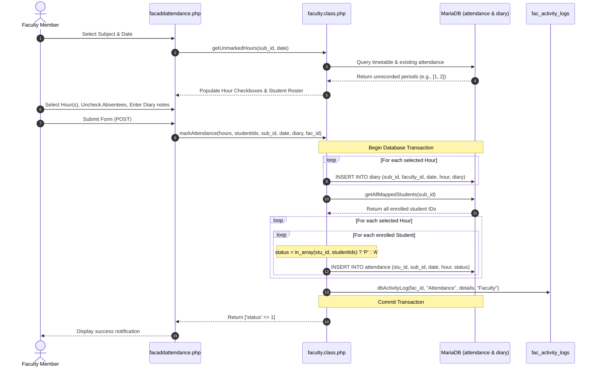

# Attendance Marking & Diary Entry Workflow

This document describes the complete lifecycle of marking daily class attendance and entering teaching diary logs by faculty members.

---

## 1. Workflow Architecture & Sequence



---

## 2. Step-by-Step Execution

### Step 1: Subject Selection & Unmarked Hours Fetch
- Faculty logs in and navigates to `facaddattendance.php`.
- The system loads the faculty's assigned subjects via `Faculty::getSubjectsByFacultyId($faculty_id)`.
- When a subject and date are picked, an AJAX request invokes `Faculty::getUnmarkedHours($sub_id, $date)`.
- The method compares the class timing periods configured in `class_timing_schedule` against periods already marked in `attendance` for that `sub_id` and `date`.
- Only unrecorded hours are displayed as selectable checkboxes. This prevents accidental duplicate attendance submissions.

### Step 2: Student Enrollment Verification
- The roster displayed to the faculty is populated from the `student_sub` junction table via `Faculty::getMappedStudents($sub_id)`.
- By default, all enrolled students are pre-checked as "Present".
- The faculty unchecks the checkboxes corresponding to students who are absent.

### Step 3: Teaching Diary Requirement
- Faculty enters a summary of syllabus topics covered during the selected periods.
- Submitting attendance without a diary entry is prevented by client-side and server-side validation.

### Step 4: Transactional Database Insertion
When the faculty submits the form:
1. `Faculty::markAttendance()` starts a transaction: `$this->conn->begin_transaction()`.
2. A record is inserted into the `diary` table for each selected period:
   ```sql
   INSERT INTO diary (sub_id, faculty_id, date, hour, diary) VALUES (?, ?, ?, ?, ?);
   ```
3. All enrolled students for that subject are fetched via `getAllMappedStudents($sub_id)`.
4. For every selected period, an attendance record is created for every mapped student:
   ```sql
   INSERT INTO attendance (stu_id, sub_id, date, hour, status) VALUES (?, ?, ?, ?, ?);
   ```
   - If the student's ID was in the checked array, `status = 'P'`.
   - If not checked, `status = 'A'`.
5. An audit entry is recorded in `fac_activity_logs`.
6. `$this->conn->commit()` is executed. If any insert fails, `$this->conn->rollback()` runs, preventing partial or inconsistent data.

---

## 3. Exceptional Attendance Marking

For special college events, sports meets, campus placement drives, or institutional permissions:
- Handled in `facexceptionalattendance.php`.
- Uses `Faculty::getStudentsForExceptionalAttendance($sub_id, $date, $hour)` and `Faculty::markExceptionalAttendance()`.
- Allows faculty to mark or update attendance for designated students outside standard timetable slots, automatically checking `student_permissions` table for sanctioned duty leaves.

---

## 4. Attendance Reports & Aggregations

Faculty and administrators can inspect marked attendance through:
- **`facshowattendance.php`**: Daily period-by-period attendance view and monthly summary.
- **`moduleshowallclsattendance.php`**: Aggregate class percentage reports categorized into:
  - $\ge 75\%$: Satisfactory.
  - $65\% \text{ to } 74.99\%$: Condonation eligible (subject to medical certificate & fees).
  - $< 65\%$: Shortage / Detention risk.
- **`export_attendance_excel.php`**: Real-time spreadsheet export of monthly attendance matrices.
