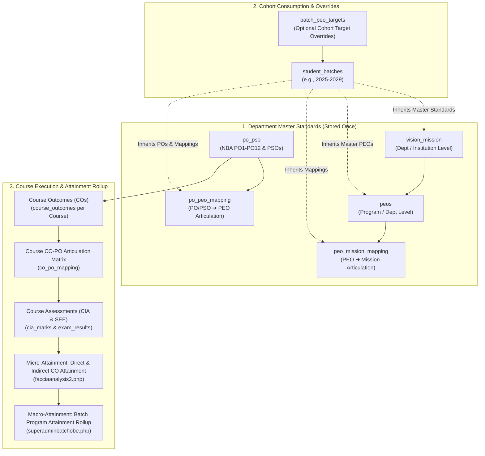

# Batch-Centric OBE Governance & Master Articulation Inheritance Workflow

This document details the multi-year Batch Cohort Lifecycle and Outcome-Based Education (OBE) Governance model designed to fulfill statutory accreditation standards (NBA Criteria 1, 2, and 3).

---

## 1. Overview & Policy Rationale

### 1.1 The Distinction: Batch vs. Academic Year vs. Regulation
In university accreditation governance, confusion often arises when tying Program Outcomes (POs) and Program Educational Objectives (PEOs) strictly to Academic Years or Curriculum Regulations:
- **Regulation (e.g., R20, R23)**: Defines course structure, contact hours, evaluation schemes (CIA/SEE weightages), and syllabus content. A regulation is typically revised every 3–4 years.
- **Academic Year (e.g., 2024-2025)**: Defines the institutional calendar during which classes run simultaneously across 1st, 2nd, 3rd, and 4th years.
- **Batch (Cohort, e.g., 2024–2028)**: The cohort of students who enter together in an admission year and graduate after completing the degree duration (e.g., B.Tech 4 years, M.Tech 2 years, MCA 2 years).

### 1.2 Accreditation Rationale for Normalized Master Definitions & Cohort Inheritance
Institutional curriculum guidelines dictate:
1. **Master Definitions Stored Once**: Vision, Mission, PEOs, POs, and PSOs are defined at the Institution, Department, or Program level. They do not change arbitrarily each year and must not be redundantly stored per cohort.
2. **Cohort Inheritance**: When a student cohort is created (e.g. `2021-2025`, `2025-2029`), it **inherits** the active master Vision, Mission, PEOs, POs/PSOs, and articulation matrices matching its academic department and entry year.
3. **NBA / Curriculum Revisions**: If NBA or Academic Authorities redefine POs or PEOs in a given year (e.g., 2025), a new version is created in the master tables with `effective_from_year = 2025`. Prior batches retain their original standards, while newly admitted cohorts inherit the revised standards.
4. **Macro-Attainment Rollup**: Final program attainment can only be calculated once a batch completes its entire degree timeline (Semesters 1 through 8 for B.Tech). The batch-centric architecture allows seamless tracking of a cohort across all 4 years regardless of intervening calendar shifts.

---

## 2. Full OBE Hierarchy Architecture

The system implements the complete institutional accreditation hierarchy:

---

## 3. Workflow Sequence Diagram

```mermaid
sequenceDiagram
    autonumber
    actor SuperAdmin
    participant BatchUI as superadminbatches.php
    participant OBEUI as superadminbatchobe.php
    participant Service as BatchOBEService.php
    participant DB as MariaDB (student_batches, vision_mission, peos, po_pso)

    Note over SuperAdmin,DB: Phase 1: Master Definition Setup (Stored Once)
    SuperAdmin->>OBEUI: Formulate Department Vision & Mission Statements
    OBEUI->>Service: saveMasterVisionMission(dept_id, vision, mission_points, effective_year)
    Service->>DB: INSERT INTO vision_mission ON DUPLICATE KEY UPDATE
    SuperAdmin->>OBEUI: Formulate Program Educational Objectives (PEO1 to PEO5)
    OBEUI->>Service: saveMasterPEO(dept_id, prog_id, peo_code, title, desc, target, effective_year)
    Service->>DB: INSERT INTO peos ON DUPLICATE KEY UPDATE
    SuperAdmin->>OBEUI: Define PEO-to-Mission Matrix
    OBEUI->>Service: savePeoMissionMatrix(dept_id, matrix)
    Service->>DB: INSERT INTO peo_mission_mapping
    SuperAdmin->>OBEUI: Define PO/PSO-to-PEO Matrix
    OBEUI->>Service: savePoPeoMatrix(dept_id, matrix)
    Service->>DB: INSERT INTO po_peo_mapping

    Note over SuperAdmin,DB: Phase 2: Cohort Creation & Instant Inheritance
    SuperAdmin->>BatchUI: Define new Batch (e.g. 2025-2029, B.Tech, 4 Years)
    BatchUI->>Service: createBatch(program_id, regulation_id, batch_name, admission_year, graduation_year)
    Service->>DB: INSERT INTO student_batches
    Note over Service,DB: Batches instantly inherit master vision, mission, PEOs, POs without creating duplicate rows!

    Note over SuperAdmin,OBEUI: Phase 3: Cohort View & Custom Overrides
    SuperAdmin->>OBEUI: Select Cohort 2025-2029
    OBEUI->>Service: getBatchPEOs(batch_id, dept_id)
    Service-->>OBEUI: Return inherited PEOs + custom target overrides
    SuperAdmin->>OBEUI: Optional: adjust target score for cohort
    OBEUI->>Service: saveBatchPEOTarget(batch_id, peo_id, target_score)
    Service->>DB: INSERT INTO batch_peo_targets

    Note over SuperAdmin,OBEUI: Phase 4: Batch Macro-Attainment Rollup
    SuperAdmin->>OBEUI: Navigate to Macro-Attainment Tab
    OBEUI->>Service: getBatchMacroAttainment(batch_id, dept_id)
    Service->>DB: Aggregate all completed courses for this batch cohort
    Service-->>OBEUI: Return Program PO Attainment, PEO Attainment & Mission Fulfillment %
```

---

## 4. Database Schema Reference

| Table Name | Entity Scope | Primary Purpose | Key Foreign Keys |
| :--- | :--- | :--- | :--- |
| `student_batches` | Cohort | Master cohort records (2021-2025, 2025-2029) | `program_id` &rarr; `programs(id)`, `regulation_id` &rarr; `regulations(id)` |
| `classes` | Section | Section-to-cohort link | `batch_id` &rarr; `student_batches(id)` |
| `vision_mission` | Department / Institution | Master Vision and parsed Mission statements | `dept_id` &rarr; `departments(id)` |
| `peos` | Program / Department | Master Program Educational Objectives | `dept_id` &rarr; `departments(id)`, `program_id` &rarr; `programs(id)` |
| `peo_mission_mapping` | Program / Department | Master PEO-to-Mission correlation matrix | `peo_id` &rarr; `peos(id)` |
| `po_pso` | Regulation / Spec | NBA Graduate Attributes (PO1-PO12) and PSOs | `specid` &rarr; `specialization(id)`, `reg_id` &rarr; `regulations(id)` |
| `po_peo_mapping` | Department | Master PO/PSO-to-PEO correlation matrix | `po_pso_id` &rarr; `po_pso(id)`, `peo_id` &rarr; `peos(id)` |
| `batch_peo_targets` | Cohort Specific | Optional cohort custom target score overrides | `batch_id` &rarr; `student_batches(id)`, `peo_id` &rarr; `peos(id)` |
