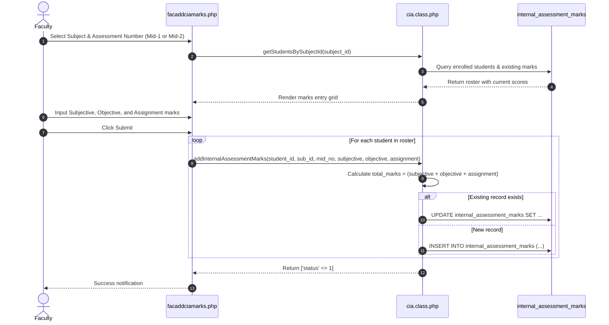

# Continuous Internal Assessment (CIA) Marks Entry & Calculation

This document outlines the workflows, calculation rules, and database pipelines for entering and calculating internal assessment marks for Undergraduate (Theory & Lab), Postgraduate (PG), and Project courses.

---

## 1. Assessment Categories & Entry Interfaces

The application supports four distinct evaluation pipelines based on the subject's curriculum structure:

| Assessment Type | Entry Controller | Database Table | Component Breakdown |
|---|---|---|---|
| **UG Theory** | `facaddciamarks.php` | `internal_assessment_marks` | Descriptive (Subjective), Objective/Quiz, Assignment |
| **UG Laboratory** | `facaddcialabmarks.php` | `uglab_internal_assessment_marks` | Day-to-Day performance, Internal Lab Examination |
| **Postgraduate (PG)** | `facaddpgciamarks.php` | `pg_internal_assessment_marks` | Mid Test, Assignment, Seminar presentation |
| **UG Project** | `facaddprojectciamarks.php` | `ugproject_internal_assessment_marks` | Project Phase Reviews (Review-1, Review-2, etc.) |

---

## 2. Marks Entry Lifecycle (UG Theory Example)

---

## 3. Regulation Calculation Rules & Condensed Views

Under autonomous academic regulations (e.g., R15, R19, R20, R23), final internal marks are computed across Mid-1 and Mid-2 using specific weightage formulas:

### 3.1 Standard Autonomous Theory Mid Aggregation
- **Mid-1 Total**: $\text{Mid}_1$ out of 30.
- **Mid-2 Total**: $\text{Mid}_2$ out of 30.
- **Combined Internal Calculation**:
  $$\text{Final Internal} = (0.80 \times \max(\text{Mid}_1, \text{Mid}_2)) + (0.20 \times \min(\text{Mid}_1, \text{Mid}_2))$$
  *(or best-of / average depending on specific cohort regulation).*

### 3.2 Condensed Views & Consolidated Reports
- **`facciamarkscondensed.php`**: Renders side-by-side Mid-1, Mid-2, and final weighted aggregate scores.
- **`facuglabciamarkscondensed.php`**: Consolidates Day-to-Day and Lab Exam marks into final lab internal score.
- **`download_cls_cia.php` / `download_bluebook.php`**: Generates printable PDF / CSV mark registers (Blue Books) required for university examinations audit.

---

## 4. Assessment Question & CO Tagging

For NBA accreditation, faculty can tag individual question papers to Bloom's taxonomy and Course Outcomes:
- **`facciacomp.php`**: Configures assessment components (Mid-1 Subjective, Objective, etc.).
- **`facciacompques.php`**: Defines question labels (Q1a, Q1b, Q2), maximum marks, and Bloom's cognitive level (`blooms_level_id`).
- **`facquestionco.php`**: Maps each question to one or more Course Outcomes (`course_outcomes`).
- **`facmarksentry.php`**: Enables granular question-by-question marks entry stored in `student_marks`.

---

## 5. File Attachments Subsystem (`facciaattachments.php`)

Faculty can attach digital documentation to each assessment (question papers, answer keys, assignment prompts):
- Files are saved in `uploads/cia_attachments/`.
- Stored in `cia_attachments`:
  - `subject_id`, `assessment_number`, `file_title`, `file_path`, `uploaded_at`.
- Managed via `Faculty::addCIAAttachment()` and `Faculty::deleteCIAAttachment()`.
