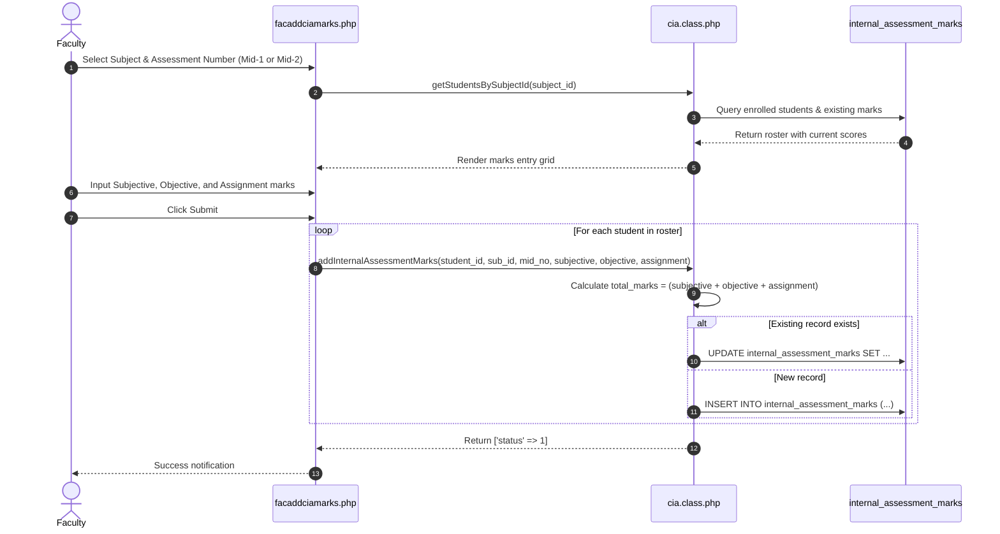

# Continuous Internal Assessment (CIA) Marks Entry & Calculation

This document outlines the workflows, calculation rules, and database pipelines for entering and calculating internal assessment marks for Undergraduate (Theory & Lab), Postgraduate (PG), and Project courses.

---

## 1. Assessment Categories & Entry Interfaces

The application supports four distinct evaluation pipelines based on the subject's curriculum structure:

| Assessment Type | Entry Controller | Database Table | Component Breakdown |
|---|---|---|---|
| **UG Theory** | `facaddciamarks.php` | `internal_assessment_marks` | Descriptive (Subjective), Objective/Quiz, Assignment |
| **UG Laboratory** | `facaddcialabmarks.php` | `uglab_internal_assessment_marks` | Day-to-Day performance, Internal Lab Examination |
| **Postgraduate (PG)** | `facaddpgciamarks.php` | `pg_internal_assessment_marks` | Mid Test, Assignment, Seminar presentation |
| **UG Project** | `facaddprojectciamarks.php` | `ugproject_internal_assessment_marks` | Project Phase Reviews (Review-1, Review-2, etc.) |

---

## 2. Marks Entry Lifecycle (UG Theory Example)

```mermaid
sequenceDiagram
    autonumber
    actor Faculty
    participant UI as facaddciamarks.php
    participant CIA as cia.class.php
    participant DB as internal_assessment_marks

    Faculty->>UI: Select Subject & Assessment Number (Mid-1 or Mid-2)
    UI->>CIA: getStudentsBySubjectId(subject_id)
    CIA->>DB: Query enrolled students & existing marks
    DB-->>CIA: Return roster with current scores
    CIA-->>UI: Render marks entry grid
    
    Faculty->>UI: Input Subjective, Objective, and Assignment marks
    Faculty->>UI: Click Submit
    
    loop For each student in roster
        UI->>CIA: addInternalAssessmentMarks(student_id, sub_id, mid_no, subjective, objective, assignment)
        CIA->>CIA: Calculate total_marks = (subjective + objective + assignment)
        alt Existing record exists
            CIA->>DB: UPDATE internal_assessment_marks SET ...
        else New record
            CIA->>DB: INSERT INTO internal_assessment_marks (...)
        end
    end
    
    CIA-->>UI: Return ['status' => 1]
    UI-->>Faculty: Success notification
```

---

## 3. Regulation Calculation Rules & Condensed Views

Under autonomous academic regulations (e.g., R15, R19, R20, R23), final internal marks are computed across Mid-1 and Mid-2 using specific weightage formulas:

### 3.1 Autonomous Regulatory Calculation Rules & Dynamic Settings
Under autonomous academic regulations (e.g., R15, R19, R20, R23), final internal marks are computed across Mid-1 and Mid-2 using specific weightage formulas retrieved dynamically via `SettingsService` (`academic_settings` table):
- **Mid-1 Total**: $\text{Mid}_1$ out of 30.
- **Mid-2 Total**: $\text{Mid}_2$ out of 30.
- **Combined Internal Calculation**:
  $$\text{Final Internal} = (W_{\text{best}} \times \max(\text{Mid}_1, \text{Mid}_2)) + (W_{\text{worst}} \times \min(\text{Mid}_1, \text{Mid}_2))$$
  - Under R19/R20/R23: $W_{\text{best}} = 0.80$ and $W_{\text{worst}} = 0.20$ (or $0.75 / 0.25$ depending on specific regulation configuration).
  - Configurable without code edits via `superadminacademicsettings.php`.

### 3.2 Condensed Views & Official e-Bluebook Export
- **`facciamarkscondensed.php`**: Renders side-by-side Mid-1, Mid-2, and final weighted aggregate scores.
- **`facuglabciamarkscondensed.php`**: Consolidates Day-to-Day and Lab Exam marks into final lab internal score.
- **`download_cls_cia.php`**: Quick tabular class CIA marks summary report.
- **`download_bluebook.php`**: Generates the complete official university **e-Bluebook** powered by `EBluebookPDFService`:
  - **Section 1**: Course Bio & Student Nominal Roll.
  - **Section 2A**: Lecture Lesson Plan (Estimated Diary).
  - **Section 2B**: Diary of Lecturer Classes (4-column statutory format).
  - **Section 2C**: Course Delivery Compliance & Deviation Report (NBA 2.2 milestone dates, deviations, compensatory classes, and signatures).
  - **Section 3**: Student Attendance Register.
  - **Section 4**: Continuous Internal Assessment (CIA) Marks Register with component breakdowns.

---

## 4. Assessment Question & CO Tagging

For NBA accreditation, faculty can tag individual question papers to Bloom's taxonomy and Course Outcomes:
- **`facciacomp.php`**: Configures assessment components (Mid-1 Subjective, Objective, etc.).
- **`facciacompques.php`**: Defines question labels (Q1a, Q1b, Q2), maximum marks, and Bloom's cognitive level (`blooms_level_id`).
- **`facquestionco.php`**: Maps each question to one or more Course Outcomes (`course_outcomes`).
- **`facmarksentry.php`**: Enables granular question-by-question marks entry stored in `student_marks`.

---

## 5. File Attachments Subsystem (`facciaattachments.php`)

Faculty can attach digital documentation to each assessment (question papers, answer keys, assignment prompts):
- Files are saved in `uploads/cia_attachments/`.
- Stored in `cia_attachments`:
  - `subject_id`, `assessment_number`, `file_title`, `file_path`, `uploaded_at`.
- Managed via `Faculty::addCIAAttachment()` and `Faculty::deleteCIAAttachment()`.

---

## 6. Semester End Examination (SEE) Evaluation Pipeline

Managed via `SEEAssessment` (`seeassessment.class.php`) and stored in `external_assessment_marks`:
- **Modes of Entry**:
  - **Mode A (`DETAILED`)** via `facseecompques.php` & `facseemarksentry.php`: Granular entry of compulsory Question 1 (covering all COs) and elective choices (Units 1-5), supporting question-level direct external attainment.
  - **Mode B (`DIRECT`)** via `facseedirectmarks.php`: Direct entry of consolidated university marks out of maximum marks (70 or 35).
- **Consolidated External Review (`facseemarkscondensed.php`)**: Side-by-side ledger displaying scored external marks and status.
