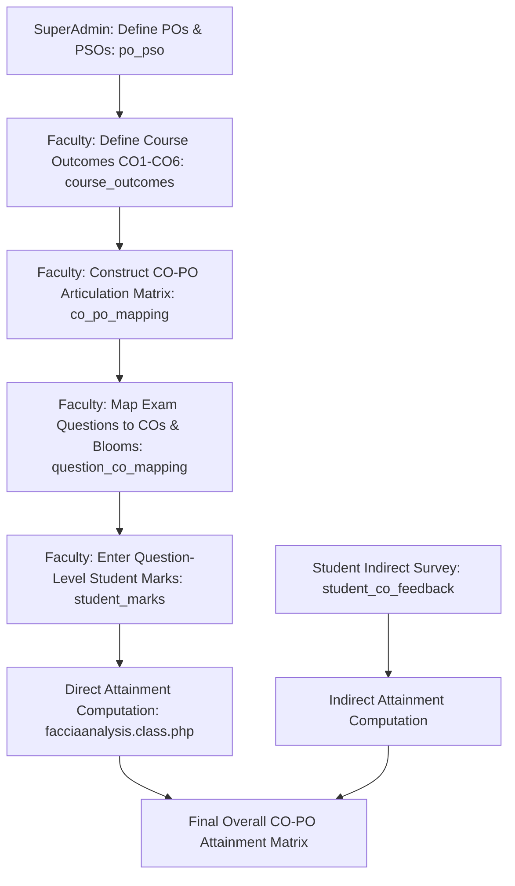

# Outcome-Based Education (OBE) & CO-PO Attainment Analysis

This document describes the Course Outcome (CO) and Program Outcome (PO) attainment computation engine designed to satisfy National Board of Accreditation (NBA) compliance.

---

## 1. OBE Architecture & Flow

---

## 2. Core Components

### 2.1 Course Outcomes Setup (`facaddcos.php`)
- Instructors formulate between 4 and 6 measurable Course Outcomes (CO1 through CO6) for their subject in `course_outcomes`.
- Each CO has a code (`co_code`) and detailed learning objective (`co_statement`).

### 2.2 CO-PO Articulation Matrix (`facarticulationmatrix.php`)
- Establishes correlations between each CO and the 12 Graduate Attributes (PO1 to PO12) plus 2–4 Program Specific Outcomes (PSO1 to PSO4).
- Correlation levels stored in `co_po_mapping`:
  - `3`: High / Substantial correlation.
  - `2`: Medium / Moderate correlation.
  - `1`: Low / Slight correlation.
  - `-` / `0`: No correlation.

### 2.3 Cognitive Domain Tagging with Bloom's Taxonomy
Each assessment question created in `assessment_questions` is categorized:
- **Bloom's Level (`blooms_level_id`)**: L1 (Remember) through L6 (Create).
- **Target CO (`question_co_mapping`)**: The specific CO evaluated by that question.
- **Maximum Marks**: Weightage of that question.

---

## 3. Direct Attainment Computation Engine

The production computation is performed in `facciaanalysis2.class.php` (which incorporates choice-aware either/or question handling, subject type branching, and suggestions; legacy `facciaanalysis.class.php` is deprecated):

1. **Target Threshold**: A benchmark percentage (e.g., $60\%$ or $65\%$) is set by the department for each question or assessment.
2. **Student Performance Evaluation**:
   - For every student $s$ and question $q$ tied to $\text{CO}_k$, determine if the marks obtained meet or exceed the target threshold:
     $$\text{Success}(s, q) = \begin{cases} 1 & \text{if } \frac{\text{Marks Obtained}}{\text{Max Marks}} \ge \text{Target} \\ 0 & \text{otherwise} \end{cases}$$
3. **Attainment Levels**:
   - The percentage of students meeting the target determines the awarded attainment level (1, 2, or 3):
     - **Level 3**: $\ge 70\%$ of students scored above target.
     - **Level 2**: $60\% - 69\%$ of students scored above target.
     - **Level 1**: $50\% - 59\%$ of students scored above target.
     - **Level 0**: $< 50\%$ of students scored above target.

---

## 4. Attainment Visualization & Reports

- **`facciaanalysis2.php`**: Primary active faculty view of direct and indirect CO attainment tables, CO-PO matrices, and charts (`facciaanalysis.php` automatically redirects here).
- **`hodciaanalysis2.php`**: Departmental roll-up across all sections and courses (`hodciaanalysis.php` automatically redirects here).
- **`adminciaanalysis2.php`**: Institutional executive dashboard monitoring OBE metrics across all degree programs and regulations (`adminciaanalysis.php` automatically redirects here).
