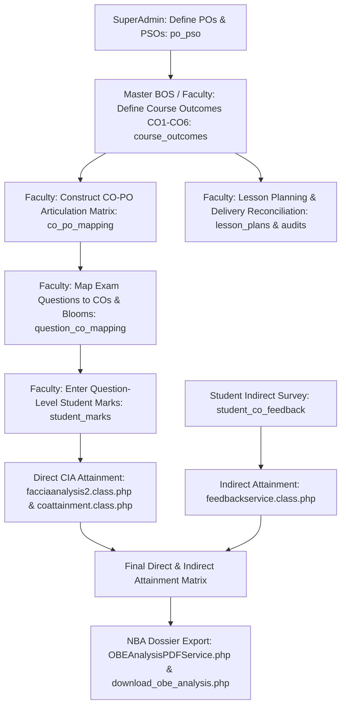

# Outcome-Based Education (OBE) & CO-PO Attainment Analysis

This document describes the Course Outcome (CO) and Program Outcome (PO) attainment computation engine designed to satisfy National Board of Accreditation (NBA) compliance.

---

## 1. OBE Architecture & Flow

```mermaid
graph TD
    A[SuperAdmin: Define POs & PSOs: po_pso] --> B[Master BOS / Faculty: Define Course Outcomes CO1-CO6: course_outcomes]
    B --> C[Faculty: Construct CO-PO Articulation Matrix: co_po_mapping]
    B --> LP[Faculty: Lesson Planning & Delivery Reconciliation: lesson_plans & audits]
    C --> D[Faculty: Map Exam Questions to COs & Blooms: question_co_mapping]
    D --> E[Faculty: Enter Question-Level Student Marks: student_marks]
    E --> F[Direct CIA Attainment: facciaanalysis2.class.php & coattainment.class.php]
    G[Student Indirect Survey: student_co_feedback] --> H[Indirect Attainment: feedbackservice.class.php]
    F & H --> I[Final Direct & Indirect Attainment Matrix]
    I --> J[NBA Dossier Export: OBEAnalysisPDFService.php & download_obe_analysis.php]
```

---

## 2. Core Components

### 2.1 Course Outcomes Setup (`facaddcos.php`)
- Instructors formulate between 4 and 6 measurable Course Outcomes (CO1 through CO6) for their subject in `course_outcomes`.
- **BOS Decoupling & Curriculum Linkage**: COs can be inherited from the master catalog via `course_outcomes.curr_sub_id = curriculum_subjects.id` or customized per offering instance (`sub_id`).
- Each outcome specifies:
  - `co_number`: Sequence index (1 to 6).
  - `co_description`: Detailed action-verb outcome statement.
  - `bloom_level`: Default Bloom's taxonomy cognitive target (e.g., `L3-Apply`).
  - `target_threshold_percent`: Benchmark threshold (defaults to 60.00%).

### 2.2 CO-PO Articulation Matrix (`facarticulationmatrix.php`)
- Establishes correlations between each CO and the 12 Graduate Attributes (PO1 to PO12) plus 2–4 Program Specific Outcomes (PSO1 to PSO4).
- Correlation levels stored in `co_po_mapping`:
  - `3`: High / Substantial correlation.
  - `2`: Medium / Moderate correlation.
  - `1`: Low / Slight correlation.
  - `-` / `0`: No correlation.

### 2.3 Cognitive Domain Tagging with Bloom's Taxonomy
Each assessment question created in `assessment_questions` is categorized:
- **Bloom's Level (`blooms_level_id`)**: L1 (Remember) through L6 (Create).
- **Target CO (`question_co_mapping`)**: The specific CO evaluated by that question.
- **Maximum Marks**: Weightage of that question.

---

## 3. Direct Attainment Computation Engine

The internal direct computation is performed via `facciaanalysis2.class.php` and modular OBE service `coattainment.class.php` (which incorporates choice-aware either/or question handling, subject type branching, and suggestions; legacy `facciaanalysis.class.php` has been cleaned up and removed):

1. **Target Threshold**: A benchmark percentage (e.g., $60\%$ or $65\%$) configured in `academic_settings` or customized per course.
2. **Student Performance Evaluation**:
   - For every student $s$ and question $q$ tied to $\text{CO}_k$, determine if the marks obtained meet or exceed the target threshold:
     $$\text{Success}(s, q) = \begin{cases} 1 & \text{if } \frac{\text{Marks Obtained}}{\text{Max Marks}} \ge \text{Target} \\ 0 & \text{otherwise} \end{cases}$$
3. **Attainment Levels**:
   - The percentage of students meeting the target determines the awarded attainment level (1, 2, or 3):
     - **Level 3**: $\ge 70\%$ of students scored above target.
     - **Level 2**: $60\% - 69\%$ of students scored above target.
     - **Level 1**: $50\% - 59\%$ of students scored above target.
     - **Level 0**: $< 50\%$ of students scored above target.

> [!NOTE]
> In CIA Analysis 2, the web dashboard focuses on Continuous Internal Assessment (CIA) direct and indirect attainment. External Semester End Examination (SEE) calculations and comprehensive direct/overall attainment are decoupled into modular engines (`seeassessment.class.php`, `coattainment.class.php`) and published in the official accreditation dossier.

---

## 4. Attainment Visualization & Dossier Reports

- **`facciaanalysis2.php`**: Primary active faculty view of direct and indirect CO attainment tables, CO-PO matrices, and interactive charts (`facciaanalysis.php` automatically redirects here).
- **`hodciaanalysis2.php`**: Departmental roll-up across all sections and courses (`hodciaanalysis.php` automatically redirects here).
- **`adminciaanalysis2.php`**: Institutional executive dashboard monitoring OBE metrics across all degree programs and regulations (`adminciaanalysis.php` automatically redirects here).
- **`download_obe_analysis.php`**: Generates the official **NBA/NAAC Course Assessment & Attainment Dossier** powered by `OBEAnalysisPDFService`. Renders complete CO formulation, Bloom level mappings, question-wise score distributions, direct/indirect attainment tables, and PO-PSO attainment articulation matrices.

---

## 5. Related Workflows
- **[Lesson Planning, Reconciliation & Compliance Workflow](./lesson-plan-and-compliance.md)**: Full lifecycle of lecture lesson plans, daily topic reconciliation, and NBA Criterion 2.2 course completion compliance audits.
- **[Student Feedback & Institutional Surveys Workflow](./feedback-surveys.md)**: Indirect CO feedback survey administration, Likert-scale analysis, and 5-domain Course End Surveys (CES).

