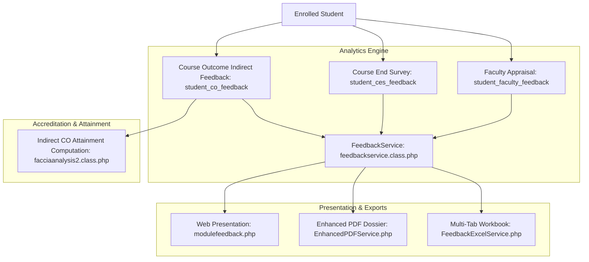

# Student Feedback & Institutional Surveys Workflow

This document details the complete end-to-end architecture, survey methodologies, data models, anonymity guarantees, and multi-granularity reporting pipelines for student feedback across Course Outcomes (CO), Course End Surveys (CES), and Faculty Appraisals.

---

## 1. Feedback Architecture & Survey Domains

The feedback subsystem captures three distinct survey instruments designed to fulfill National Board of Accreditation (NBA) and NAAC requirements:

---

## 2. Survey Instruments & Data Models

### 2.1 Course Outcome (CO) Feedback (`student_co_feedback`)
- Evaluates student perception of outcome mastery per Course Outcome (`co_id` referencing `course_outcomes.id`).
- Rated on a 5-point Likert scale (1 = Poor to 5 = Excellent).
- **Target Attainment Benchmark**: Ratings $\ge 3.0$ (or $60\%$) indicate successful outcome attainment.
- Unique constraint: `(student_id, subject_id, co_id)`.

### 2.2 Course End Survey (CES) (`student_ces_feedback`)
- Comprehensive 16-item survey evaluating the course across five accredited domains:
  - **Domain 1: Curriculum & Syllabus Coverage** (`ces_q1` &ndash; `ces_q4`)
  - **Domain 2: Pedagogy & Teaching-Learning Process** (`ces_q5` &ndash; `ces_q8`)
  - **Domain 3: Evaluation & Assessment Quality** (`ces_q9` &ndash; `ces_q11`)
  - **Domain 4: Learning Resources & Academic Support** (`ces_q12` &ndash; `ces_q14`)
  - **Domain 5: Outcome Attainment & Professional Growth** (`ces_q15` &ndash; `ces_q16`)
- **Part-C Qualitative Feedback**:
  - `useful_aspects`: Most valuable learning concepts and course elements.
  - `improvement_topics`: Topics requiring enhanced coverage or pedagogical revision.
  - `suggestions`: General actionable recommendations for course enhancement.
- Unique constraint: `(student_id, subject_id)`.

### 2.3 Student Appraisal of Faculty (`student_faculty_feedback`)
- Evaluates instructor performance across 19 pedagogical criteria (`fac_q1` to `fac_q19`):
  - Subject competence, communication clarity, punctuality, and syllabus coverage pace.
  - Classroom interaction, real-world examples, grading fairness, and out-of-class mentoring.
  - Pacing, script return timeliness, supplementary resources, ICT tools, and student motivation.
- **Qualitative Observations**:
  - `faculty_strengths`: Key teacher strengths appreciated by students.
  - `improvement_areas`: Specific constructive feedback for instructional growth.
  - `additional_comments`: Unstructured observations or remarks.
- Unique constraint: `(student_id, subject_id, faculty_id)`.

---

## 3. Anonymity Guarantees (`is_anonymous`)

> [!IMPORTANT]
> **Strict Faculty Appraisal Anonymity**: Student feedback on instructors requires total confidentiality to guarantee honest, uncoerced student appraisals.
> - In `student_faculty_feedback`, the column `is_anonymous` defaults to `1`.
> - Student names and hall ticket roll numbers are completely suppressed from faculty, HOD, and administrative views.
> - Web views (`modulefeedback.php`), PDF reports (`EnhancedPDFService.php`), and Excel exports (`FeedbackExcelService.php`) never expose student identities for faculty appraisal responses.

---

## 4. Multi-Granularity Analytics Engine (`FeedbackService`)

Located in [`feedbackservice.class.php`](file:///Applications/XAMPP/xamppfiles/htdocs/classattendance.in/jntuacea/feedbackservice.class.php), this service aggregates feedback data at four distinct administrative levels:

| Method | Scope | Used By | Description |
|---|---|---|---|
| `getSubjectFeedback($subject_id, $class_id)` | Subject | Faculty / HOD / Admin | Evaluates CO mastery, rating distribution (5★ to 1★), CES domains, faculty appraisal, and qualitative remarks for a single subject. |
| `getClassFeedback($class_id)` | Class Cohort | HOD / Admin | Aggregates all subjects taught within a specific class semester, computing cohort-wide response rates and subject comparisons. |
| `getFacultyFeedback($faculty_id)` | Faculty Member | Faculty / HOD / Admin | Aggregates appraisal across all courses taught by an instructor, providing personal teaching metrics and student comments. |
| `getDepartmentFeedback($dept_id)` | Department | HOD / Admin | Institutional departmental roll-up for academic audits and NAAC/NBA criteria documentation. |

---

## 5. Web Presentation Layer (`modulefeedback.php`)

[`modulefeedback.php`](file:///Applications/XAMPP/xamppfiles/htdocs/classattendance.in/jntuacea/modulefeedback.php) provides a standardized, responsive interface component embedded inside:
- [`facviewfeedback.php`](file:///Applications/XAMPP/xamppfiles/htdocs/classattendance.in/jntuacea/facviewfeedback.php) (Faculty personal view)
- [`hodviewfeedback.php`](file:///Applications/XAMPP/xamppfiles/htdocs/classattendance.in/jntuacea/hodviewfeedback.php) (Departmental view)
- [`adminviewfeedback.php`](file:///Applications/XAMPP/xamppfiles/htdocs/classattendance.in/jntuacea/adminviewfeedback.php) (Institutional administrator view)

### Layout Flow:
1. **Executive KPI Cards**: Total enrolled students, total respondents, response percentage, and overall average score.
2. **Interactive Chart Visualizations**:
   - *CO Average Ratings & Target Threshold*: Bar chart with a 3.0 / 60% threshold benchmark line.
   - *CO Rating Distribution*: Stacked bar chart showing percentage breakdown from 5★ down to 1★.
   - *CES 5-Domain Performance*: Domain radar or horizontal bar comparison across Curriculum, Pedagogy, Evaluation, Resources, and Outcomes.
3. **Course Outcome Indirect Attainment Table**: Detailed tabular breakdown per CO code with average score, threshold check, and attainment status.
4. **Collapsible Qualitative Remarks Ribbons**:
   - *CES Part-C Qualitative Remarks*: Expandable ribbon card (hidden by default) displaying Useful Aspects, Improvement Topics, and Suggestions.
   - *Student Qualitative Remarks on Faculty*: Expandable ribbon card (hidden by default) displaying Faculty Strengths, Improvement Areas, and Comments.

---

## 6. Official Dossier Exports

### 6.1 Enhanced PDF Reports (`EnhancedPDFService.php`)
- Endpoint: `download_feedback_enhanced.php`
- Powered by TCPDF to produce formal, print-ready institutional accreditation documents.
- Includes institutional letterhead, meta summaries, all 5 rating distributions (5★, 4★, 3★, 2★, 1★) with proportional progress bars, domain breakdowns, and qualitative student feedback.

### 6.2 Analytical Excel Workbooks (`FeedbackExcelService.php`)
- Endpoint: `download_feedback_excel.php`
- Powered by PhpSpreadsheet to generate multi-worksheet analytical workbooks:
  - **Summary**: High-level metrics, enrollment, response rates, and average ratings.
  - **CO Attainment**: Detailed per-CO scores, student counts, and threshold attainment indicators.
  - **CES Domains**: Average scores for each of the 5 NAAC/NBA domains.
  - **Raw - Student CO Matrix**: Anonymized row-by-row audit data of student CO responses.
  - **Raw - CES**: Anonymized survey responses across all 16 questions and qualitative fields.
  - **Raw - Faculty Appraisal**: Strictly anonymized student evaluations across 19 criteria.
