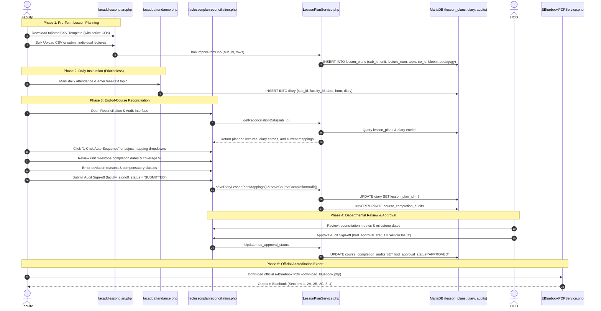

# Lesson Planning, Reconciliation & Course Delivery Compliance Workflow

This document details the complete end-to-end lifecycle for lecture lesson planning, daily topic reconciliation, and course completion compliance auditing designed to fulfill National Board of Accreditation (NBA) Criterion 2.2 requirements.

---

## 1. Overview & Policy Rationale

To ensure educational quality and meet NBA Criterion 2.2 ("Teaching-Learning Process & Course Delivery"):
- **Proactive Syllabus Planning**: Instructors plan lecture-by-lecture delivery schedules mapped to specific Course Outcomes (COs), cognitive Bloom levels, and pedagogical methods before or at the start of the term.
- **Frictionless Daily Execution**: Instructors log daily teaching diary topics in free-text with zero administrative overhead during daily attendance marking.
- **Systematic End-of-Course Reconciliation**: At the conclusion of instructional delivery, instructors reconcile actual diary logs against the planned schedule, identifying deviations, missed topics, and compensatory classes.
- **Audited Compliance Sign-off**: Faculty submit a formal course completion audit with unit milestone dates, deviation rationales, and compensatory measures for departmental Head of Department (HOD) approval.
- **Statutory Accreditation Artifacts**: The reconciled delivery and compliance report are compiled into Section 2A, Section 2B, and Section 2C of the official university e-Bluebook.

---

## 2. Architecture & Workflow Sequence

---

## 3. Step-by-Step Implementation

### Step 1: Lesson Plan Formulation (`facaddlessonplan.php`)
- **Prerequisites**: Course Outcomes (CO1 to CO6) must be formulated first in `facaddcos.php`.
- **CSV Template Download**:
  - Emitted with UTF-8 BOM for clean Microsoft Excel opening without character corruption.
  - Dynamically populates sample rows referencing the subject's active Course Outcomes.
- **Bulk Upload Parser**:
  - Sanitizes user variations (e.g., handles "Unit 1", "Lec 1", "CO1", "Apply" vs "L3-Apply").
  - Verifies planned hours, pedagogy choices (`Chalk & Talk`, `PPT/LCD`, `Coding Demo`, `Video`, `Flipped`), and references.
  - Stored in `lesson_plans` table with unique constraint `(sub_id, lecture_number)`.
- **Interactive Editing**:
  - Inline "Edit" button populates lecture form fields directly from table rows.
  - "Clear All Lectures" action backed by `LessonPlanService::clearPlanBySubject()`.

### Step 2: Daily Instruction & Diary Logging (`facaddattendance.php`)
- Daily attendance is marked with 100% natural free-text topic entry.
- Zero friction: Instructors are not interrupted by mandatory CO dropdowns or popups during morning or evening attendance marking.
- Diary records are stored in `diary` with `lesson_plan_id = NULL` initially.

### Step 3: End-of-Course Reconciliation (`faclessonplanreconciliation.php`)
- Instructors navigate to **Course Delivery Reconciliation & Audit** at semester end.
- The interface presents side-by-side matching of planned lectures against chronological daily diary entries.
- **1-Click Auto-Sequence**: Automatically binds chronological diary entries to sequential planned lectures, instantly establishing `diary.lesson_plan_id`.
- Dynamic CO badges and unit indicators display mapped outcomes in real time.
- Uncovered lectures or extra compensatory lectures are clearly highlighted.

### Step 4: Course Delivery Compliance & Deviation Audit
Stored in `course_completion_audits`:
- **Quantitative Metrics**:
  - Total Planned Lectures vs Total Actual Conducted.
  - Number of Compensatory / Extra Classes conducted.
  - Syllabus Completion Percentage ($= \frac{\text{Conducted}}{\text{Planned}} \times 100\%$).
- **Unit Milestone Completion Dates**:
  - Auto-calculated or confirmed completion dates for Unit 1, Unit 2, Unit 3, Unit 4, and Unit 5.
- **Qualitative Justifications**:
  - `deviations_reason`: Detailed reasons for topic sequence changes or syllabus pacing adjustments.
  - `compensatory_actions`: Extra classes, tutorial sessions, or LMS materials provided to cover syllabus shortfalls.
  - `topics_beyond_syllabus`: Advanced state-of-the-art topics covered beyond prescribed syllabus.
- **Governance Gate**:
  - Faculty submits with status `'SUBMITTED'`.
  - Department HOD reviews, enters optional remarks, and approves (`'APPROVED'`).

---

## 4. Official e-Bluebook Integration (`EBluebookPDFService.php`)

When generating the statutory university course Bluebook via [`download_bluebook.php`](file:///Applications/XAMPP/xamppfiles/htdocs/classattendance.in/jntuacea/download_bluebook.php), the reconciled data renders as three cohesive sections:

1. **Section 2A: Lecture Lesson Plan (Estimated Diary)**:
   - Full tabular schedule of planned lectures with Unit, Lecture No, Topic Description, Target CO, Bloom Level, Pedagogy, and References.
2. **Section 2B: Diary of Lecturer Classes (Actual Conducted Diary)**:
   - Standard 4-column university register layout: `S.No`, `Date`, `Time / Period`, and `Topics Covered`.
3. **Section 2C: Course Delivery Compliance & Deviation Report (NBA 2.2)**:
   - Executive metrics table comparing planned vs conducted classes.
   - Milestone completion dates across all 5 units.
   - Recorded deviations and compensatory measures.
   - Dual formal signature blocks for Course Instructor and Head of Department.
