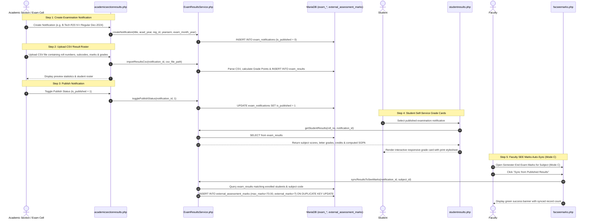

# Examination Results Publication & SEE Auto-Sync Workflow

This document details the lifecycle for examination notification creation, bulk result ingestion via CSV, UGC 10-point scale grade conversion, student self-service grade card viewing, and automated synchronization into faculty Semester End Examination (SEE) assessment registers.

---

## 1. Overview & Policy Rationale

### 1.1 The Challenge of Disconnected Systems
In many autonomous institutions, semester end examinations are evaluated centrally by the Examination Branch, while department faculty separately evaluate Continuous Internal Assessment (CIA) and Course Outcome attainment:
- Without integration, faculty are forced to manually transcribe hundreds of external marks from paper lists or separate spreadsheets into the OBE software.
- Manual re-entry introduces clerical transcription errors, delays accreditation reporting, and wastes hundreds of faculty hours each semester.

### 1.2 The Integrated Solution
The Results Publication subsystem bridges the Examination Branch, Department Faculty, and Students:
1. **Academic Section / Exam Cell**: Publishes official semester exam notifications, uploads verified university CSV result rosters, reviews preview tables, and toggles results live (`is_published = 1`).
2. **Student Portal**: Students immediately access their official semester grade cards with letter grades, credits, grade points, and automatically calculated SGPA.
3. **Faculty SEE Marks Auto-Sync**: In `facseemarks.php`, faculty select **Mode C (Sync from Published Results)** to pull external examination scores directly into `external_assessment_marks`, automatically populating direct SEE attainment models.

---

## 2. UGC 10-Point Scale & SGPA Computation

The system uses standard autonomous UGC grading scales implemented inside `ExamResultsService::getGradePoints()`:

| Letter Grade | Description | Marks Range (%) | Grade Points ($GP_i$) | Result Status |
| :---: | :---: | :---: | :---: | :---: |
| **O** | Outstanding | $\ge 90\%$ | 10 | PASS |
| **S** | Excellent | $80\% - 89\%$ | 9 | PASS |
| **A** | Very Good | $70\% - 79\%$ | 8 | PASS |
| **B** | Good | $60\% - 69\%$ | 7 | PASS |
| **C** | Fair | $50\% - 59 Tart$ | 6 | PASS |
| **D** | Satisfactory | $40\% - 49\%$ | 5 | PASS |
| **E** | Pass | $35\% - 39\%$ | 4 | PASS |
| **F** | Fail | $< 35\%$ | 0 | FAIL |
| **ABSENT** | Absent | Absent | 0 | ABSENT |

### Semester Grade Point Average (SGPA) Formula
$$\text{SGPA} = \frac{\sum_{i=1}^{n} (C_i \times GP_i)}{\sum_{i=1}^{n} C_i}$$
Where:
- $C_i$ = Credits assigned to course $i$
- $GP_i$ = Grade points earned in course $i$
- Courses with letter grade `F` or `ABSENT` are included in the denominator $\sum C_i$ with $GP_i = 0$, properly reflecting academic standing.

---

## 3. Workflow Sequence Diagram



---

## 4. Step-by-Step Implementation

### Step 1: Notification Creation (`academicsectionresults.php`)
- **Access Guard**: Authorized for `academic_section`, `admin`, and `superadmin`.
- **Form Parameters**:
  - `title`: Institutional title (e.g., `B.Tech III-I R20 Regular Examinations Nov 2024`).
  - `acad_year_id`: Active academic calendar year.
  - `regulation_id`: Regulatory code (e.g., R20).
  - `yearsem`: Academic level (`1-1`, `1-2`, `2-1`, `2-2`, `3-1`, `3-2`, `4-1`, `4-2`).
  - `exam_month_year`: Examination session period (e.g., `NOVEMBER 2024`).

### Step 2: CSV Data Ingestion & Sanitization
- Expected CSV column headers:
  ```csv
  roll_number,student_name,subject_code,subject_name,internal_marks,external_marks,total_marks,grade,credits,result_status
  21001A0501,JOHN DOE,20A54101,LINEAR ALGEBRA,28,52,80,S,3,PASS
  ```
- Parser logic in `ExamResultsService::importResultsCsv`:
  1. Validates presence of header columns.
  2. Sanitizes input marks (ensuring numbers or handling absent markers).
  3. Computes `grade_points` automatically if omitted or validates supplied points against the UGC scale.
  4. Executes batch upsert inside an atomic database transaction.

### Step 3: Publication & Access Control
- Notifications start in draft state (`is_published = 0`), visible only to administrators for data verification.
- Clicking **Publish** makes results visible to enrolled students and accessible for faculty auto-sync.

### Step 4: Faculty Auto-Sync Engine (`ExamResultsService::syncResultsToSeeMarks`)
- Matches the offering subject code in `subjects` or `curriculum_subjects` against `exam_results.subject_code`.
- Matches enrolled students in `student_sub` against `exam_results.roll_number`.
- Updates `external_assessment_marks`:
  ```sql
  INSERT INTO external_assessment_marks
    (sub_id, student_id, external_marks, max_marks, q1_marks, choice_marks)
  VALUES (?, ?, ?, 70.00, NULL, NULL)
  ON DUPLICATE KEY UPDATE
    external_marks = VALUES(external_marks),
    max_marks = 70.00,
    q1_marks = NULL,
    choice_marks = NULL
  ```
- This seamlessly bridges external marks into `SEEAssessment::calculateSeeAttainment()`.

---

## 5. Database Schema Reference

| Table Name | Description | Key Foreign Keys |
| :--- | :--- | :--- |
| `exam_notifications` | Master examination event notifications | `acad_year_id` &rarr; `academic_years(id)`, `regulation_id` &rarr; `regulations(id)` |
| `exam_results` | Student subject scores, grades, credits, grade points | `notification_id` &rarr; `exam_notifications(id)` |
| `external_assessment_marks` | Faculty external assessment register | `sub_id` &rarr; `subjects(id)`, `student_id` &rarr; `students(id)` |
