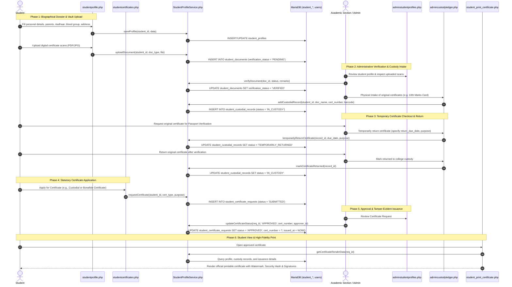

# Student Biographical Dossier, Document Vault, Custody Ledger & Statutory Certificates Workflow

This document details the lifecycle for student biographical profiling, cloud document vault storage, physical original certificates custody governance, and self-service statutory certificate issuance.

---

## 1. Overview & Policy Rationale

Autonomous engineering colleges and university constituent colleges are legally accountable for maintaining statutory student identity records and safely managing original student certificates submitted at the time of admission:
1. **Biographical Dossier**: Centralizes personal, parental, demographic, category/quota, and contact records.
2. **Cloud Document Vault**: Provides students a secure digital vault to upload PDF/JPG scans of prerequisite certificates (Aadhaar, SSC, Intermediate/Diploma, Entrance Rank Cards, Caste, Income).
3. **Physical Custody Ledger**: Under autonomous university rules, original certificates are retained in college custody until degree completion. When students require original certificates temporarily (e.g., for Passport verification, Visa interviews, or Education Loans), a formal audited custody ledger tracks checkout, due date, return, or permanent clearance.
4. **Statutory Certificate Generation**: Automates the request, administrative review, and generation of official institutional certificates:
   - **Bonafide / Study Certificate**
   - **Conduct Certificate**
   - **Custodial Certificate** (formally certifying all original certificates held in institutional custody)
   - **Transfer Certificate (TC)**

---

## 2. Architecture & Workflow Sequence

---

## 3. Step-by-Step Implementation

### Step 1: Biographical Dossier (`studentprofile.php`)
- **Demographics**: Father's name, Mother's name, Date of Birth, Gender, Blood Group, Aadhaar Number, Category/Quota (OC, BC-A, BC-B, SC, ST, EWS, Management, NRI), Religion, Nationality.
- **Academic Coordinates**: Admission Date, Hall Ticket / Roll Number, Permanent Address, Current Address, Emergency Contact.
- **Verification Workflow**: Academic Section officers can mark profiles as `VERIFIED` with formal administrative notes.

### Step 2: Cloud Document Vault
- Supported document types:
  - `AADHAAR`: National Identity Card scan.
  - `SSC_MARKS`: Class 10 / Secondary School Certificate.
  - `INTER_MARKS`: Class 12 / Intermediate / Diploma Certificate.
  - `ENTRANCE_RANK_CARD`: EAMCET / ECET / ICET Rank Card.
  - `CASTE_CERT`: Community / Category Certificate.
  - `INCOME_CERT`: Statutory Income Certificate for fee reimbursement.
- File security: Stored under sanitized file hashes in `uploads/student_docs/` with file mime validation and direct PHP execution blocking.

### Step 3: Physical Custody Ledger (`admincustodyledger.php`)
- Records physical documents surrendered upon admission:
  - Document name & serial/certificate number.
  - Custody barcode/rack/box locator for physical archives.
  - Lifecycle state machine:
    - `IN_CUSTODY`: Secured in college records room.
    - `TEMPORARILY_RETURNED`: Checked out with strict `return_due_date` and purpose log.
    - `PERMANENTLY_RETURNED`: Released permanently upon graduation or formal TC issuance.

### Step 4: Statutory Certificate Engine (`StudentProfileService`)
- Supported certificate categories:
  1. **Bonafide / Study Certificate**: Certifies current enrollment, academic year, regulation, and course duration.
  2. **Conduct Certificate**: Attests to moral character, discipline, and campus conduct.
  3. **Custodial Certificate**: Formally enumerates every original document held in university custody, allowing students to present proof of custody to embassies, passport authorities, and financial institutions without withdrawing their physical originals.
  4. **Transfer Certificate (TC)**: Formal institutional departure certificate.
- **Tamper-Evident Security Features (`student_print_certificate.php`)**:
  - Unique Institutional Certificate Number (e.g., `JNTUACEA/CUST/2024/0042`).
  - Cryptographic Verification Hash (SHA-256 derived from student roll, certificate number, and issuance timestamp).
  - Background university seal watermark.
  - Formal signature blocks for Head of Department (HOD) and Principal.

---

## 4. Database Schema Reference

| Table Name | Description | Key Foreign Keys |
| :--- | :--- | :--- |
| `student_profiles` | Demographic & biographical student records | `student_id` &rarr; `students(id)` |
| `student_documents` | Cloud digital document scans & verification statuses | `student_id` &rarr; `students(id)`, `verified_by` &rarr; `users(id)` |
| `student_custodial_records` | Physical original certificate custody tracking | `student_id` &rarr; `students(id)`, `received_by` &rarr; `users(id)` |
| `student_certificate_requests` | Self-service certificate applications & approvals | `student_id` &rarr; `students(id)`, `processed_by` &rarr; `users(id)` |
