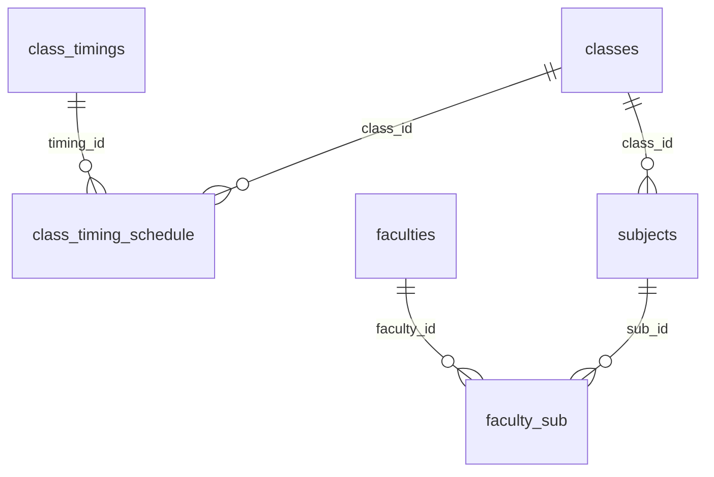
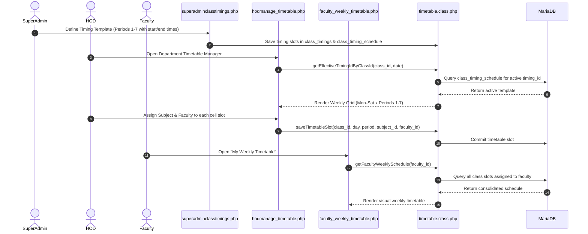

# Timetable Management & Scheduling

This document details the configuration of bell schedules, class timing schedules, weekly timetable mapping, and faculty schedule views.

---

## 1. System Structure

Timetable operations are governed by three interacting layers:
1. **Timing Templates (`class_timings`)**: Global period schedules defining the start and end times for each period/hour (Periods 1 to 7).
2. **Class-Timing Schedule (`class_timing_schedule`)**: Maps a class cohort to a specific timing template for a defined date range (`from_date` to `to_date`).
3. **Weekly Timetable Allocations (`timetable.class.php`)**: Day-by-day, period-by-period allotment of subjects and faculties to classrooms.



---

## 2. Timetable Configuration Sequence



---

## 3. Effective Timing Resolution

Because colleges often change period timings during summer or examination terms:
- Timings are not hardcoded.
- `Timetable::getEffectiveTimingIdByClassId($class_id, $for_date)` resolves the active timing template using chronological date ranges:
```sql
SELECT timing_id
FROM class_timing_schedule
WHERE class_id = ?
  AND from_date <= ?
  AND (to_date IS NULL OR to_date >= ?)
ORDER BY from_date DESC, id DESC
LIMIT 1;
```

---

## 4. Key Interfaces & Scripts

- **`superadminclasstimings.php`**: Superadmin interface to configure master bell timings (Period 1: 09:00 - 09:50, Period 2: 09:50 - 10:40, etc.).
- **`hodmanage_timetable.php`**: HOD interface to build weekly class schedules, ensuring faculty are not double-booked across different sections during the same period.
- **`viewtimetable.php`**: Public and student-facing view of section timetables.
- **`faculty_weekly_timetable.php`**: Personalized schedule for instructors summarizing their weekly teaching commitments across multiple classes and departments.
